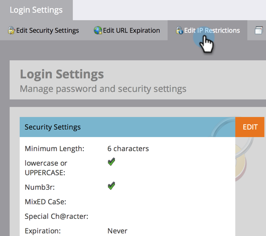

# IP に基づく Marketo ログインの制限 {#restrict-marketo-logins-based-on-ip}

IP アドレスに基づいて、ユーザの Marketo へのアクセスを制限または有効にできます。 次の手順に従います。

>[!NOTE]
>
>**管理者権限が必要**

>[!IMPORTANT]
>
>Adobe Admin Console （AAC）は[IP ベースのアクセス制御](https://helpx.adobe.com/jp/enterprise/using/ip-based-access.html){target="_blank"}をサポートしています。 移行をスムーズに行うために、この機能が有効になっているサブスクリプションでは、Adobe ID ユーザーを含む既存のMarketo Engage IP制限が2027年第1四半期まで有効になります。
>
>* AAC IP ベースのアクセスはいつでも設定できます。
>* AACとMarketo Engageの両方の制限を同時に実行できます。 互換性のために同じIP許可リストを使用してください。
>
>2027年第1四半期以降、Marketo EngageのIP制限は廃止されます。 IP ベースのアクセスはAAC経由でのみ管理され、ログイン制限を適用するように設定する必要があります。 最終的な移行日は後でお知らせします。

1. 「**[!UICONTROL 管理者]**」領域に移動します。

   

1. 「**[!UICONTROL ログイン設定]**」をクリックします。

   

1. 「**[!UICONTROL IP 制限を編集]**」をクリックします。

   

1. **許可**&#x200B;または&#x200B;**ブロック**&#x200B;の特定のアドレスのいずれかを選択し、1つ以上のアドレスを入力してから、**[!UICONTROL 保存]**&#x200B;をクリックします。

   >[!NOTE]
   >
   >**定義**
   >
   >* **[!UICONTROL 許可済み IP アドレス]**：許可済み IP アドレスの追加は包含的です。 指定したすべての IP アドレスが含まれ、その他すべてが除外されます。
   >* **[!UICONTROL ブロック済み IP アドレス]**：特定の IP が Marketo にアクセスするのを防ぎます。
   >* **[!UICONTROL IP 制限の無効化]**：これをオンにすると、すべての制限ルールが機能を停止します。 これはテスト目的で使用します。

   >[!NOTE]
   >
   >複数の制限を追加できますが、すべて許可されるか、すべてブロックされるかのいずれかとなります。 許可されたアドレスとブロックされたアドレスを組み合わせることはできません。

   
