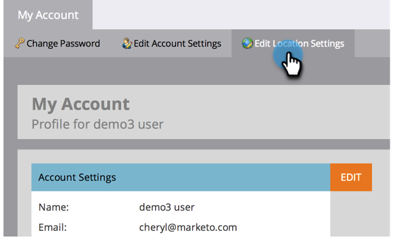

# 言語、ロケール、タイムゾーンの選択 {#select-your-language-locale-and-time-zone}

英語が第一言語ではない方も、心配は無用です。Marketo Engage インスタンスの言語、ロケール、タイムゾーンの変更方法を以下に示します。

>[!IMPORTANT]
>
>この記事は、[Adobe ID で Marketo](/help/marketo/product-docs/administration/marketo-with-adobe-identity/adobe-identity-management-overview.md){target="_blank"} を使用し&#x200B;_ない_&#x200B;ユーザのみを対象としています。その場合は、[アドビアカウントプロファイル](https://account.adobe.com/profile){target="_blank"}で以下に説明する設定にアクセスできます。

## サポートされている言語 {#supported-languages}

* 英語
* フランス語
* ドイツ語
* 日本語
* ポルトガル語
* スペイン語

## ユーザの言語、ロケール、タイムゾーンの変更 {#change-user-language-locale-and-time-zone}

1. 「**[!UICONTROL 管理者]**」領域に移動します。

   

1. 「**[!UICONTROL マイアカウント]**」を選択します。

   

1. 「マイアカウント」で、「**[!UICONTROL ロケーション設定を編集]**」をクリックします。

   

1. 「**[!UICONTROL 言語]**」を変更します。

   

   >[!TIP]
   >
   >また、ログインページ上部の「言語」ドロップダウンをクリックして、言語のみを変更することもできます。

1. 「**[!UICONTROL ロケール]**」を変更します。

   

1. 「**[!UICONTROL タイムゾーン]**」を変更します。

   

1. 「**[!UICONTROL 保存]**」をクリックします。

   

以上です。ブラウザーが更新され、変更が反映されていることが確認できます。

