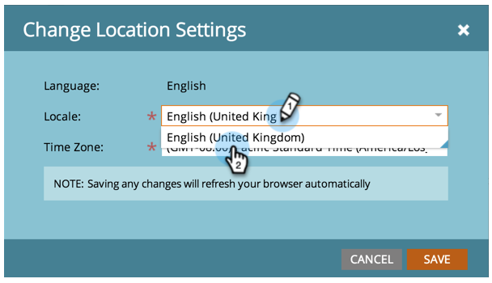
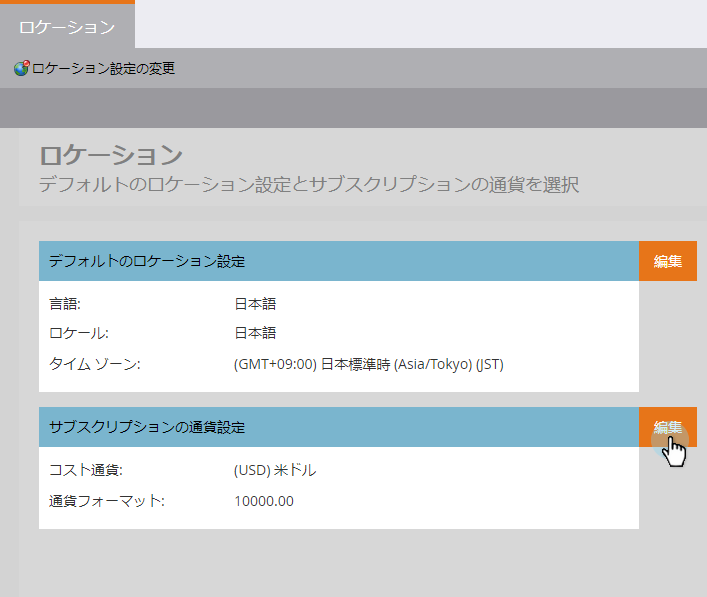
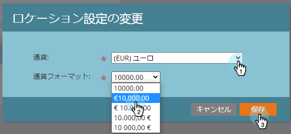

# 購読のデフォルトの場所の設定 {#set-default-location-settings-for-a-subscription}

この記事では、購読のデフォルトの場所の設定（言語、ロケール、タイムゾーンなど）を管理者が表示および編集する方法について説明します。

>[!NOTE]
>
>管理者権限が必要です。 通常、言語は管理者が変更するものではありません。 購入時に指定するので、適切な購読で生成できます。

## 購読のデフォルトの場所の設定 {#set-default-location-settings-for-a-subscription-1}

管理者がデフォルトの場所の設定を変更すると、新しく作成したユーザーはこれらの設定を継承します。 ユーザーは、個々のアカウントで常に言語、ロケールおよびタイムゾーンの環境設定を [変更できます](select-your-language-locale-and-time-zone.md) 。

1. 「 **管理者**」で、** **「 **場所**」をクリックします。

   

1. 「 **編集**」をクリックします。

   

   この購読は英語で作られた。 ロンドンにいて、デフォルトのロケールとタイムゾーンを変更したい場合、 ロケールによって、数値、日付および時間の形式設定が決まります。

1. 「 **ロケール** 」を選択し、「 **英語** （英国）」に変更します。

   

1. 最後に、適切な **タイムゾーンを選択します**。

   

   >[!NOTE]
   >
   >Marketo Sales Insight for [Salesforce.com](http://salesforce.com/) は、フランス語、ドイツ語、日本語、ポルトガル語、スペイン語をサポートしています。

## 購読のデフォルトの通貨設定の指定 {#set-the-default-currency-settings-for-a-subscription}

ユーザーのデフォルトロケールを変更する場合は、通貨形式の設定を変更することもできます。

1. [ **編集** ] [購読通貨設定]をクリックします。

   

1. 選択した通貨形式を選択し、「 **保存**」をクリックします。

   

   おめでとう！ 購読の場所の設定が変更されました。

>[!MORELIKETHIS]
>
>* [言語、ロケール、タイムゾーンの選択](select-your-language-locale-and-time-zone.md)

>

