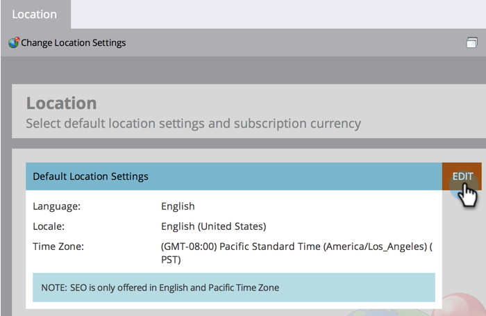

# サブスクリプションのデフォルトの場所の設定 {#set-default-location-settings-for-a-subscription}

この記事では、言語、ロケール、タイムゾーンなど、サブスクリプションのデフォルトの場所の設定を、管理者が表示および編集する方法について説明します。

>[!NOTE]
>
>管理者権限が必要。通常、言語は管理者が変更するものではありません。適切な言語でサブスクリプションを生成できるように、購入時に指定されます。

## サブスクリプションのデフォルトの場所の設定 {#set-default-location-settings-for-a-subscription-1}

管理者がデフォルトの場所の設定を変更すると、新しく作成されたユーザはこれらの設定を継承します。ユーザはいつでも個々のアカウントで、[言語、ロケール、タイムゾーンの環境設定を変更する](/help/marketo/product-docs/administration/settings/select-your-language-locale-and-time-zone.md)ことができます。

1. 「**管理者**」領域に移動します。

   

1. 「**場所**」をクリックします。

   

1. 「**編集**」をクリックします。

   

   このサブスクリプションは英語で作成されました。例えば、ロンドンにいるとして、デフォルトのロケールとタイムゾーンを変更するとします。ロケールによって、数値、日付、時刻の書式が決まります。

1. 「**ロケール**」を選択して、「**英語**（英国）」に変更します。

   

1. 最後に、適切な「**タイムゾーン**」を選択します。

   

   >[!NOTE]
   >
   >[Salesforce.com](https://salesforce.com/) 用 Marketo Sales Insight は、フランス語、ドイツ語、日本語、ポルトガル語、スペイン語をサポートしています。

## サブスクリプションのデフォルトの通貨の設定 {#set-the-default-currency-settings-for-a-subscription}

ユーザのデフォルトのロケールを変更する場合は、通貨形式の設定も変更します。

1. 「サブスクリプション通貨の設定」で、「**編集**」をクリックします。

   

1. 通貨形式を選択し、「**保存**」をクリックします。

   

   これで完了です。サブスクリプションの場所の設定を変更しました。

>[!MORELIKETHIS]
>
>* [言語、ロケール、タイムゾーンの選択](/help/marketo/product-docs/administration/settings/select-your-language-locale-and-time-zone.md)

