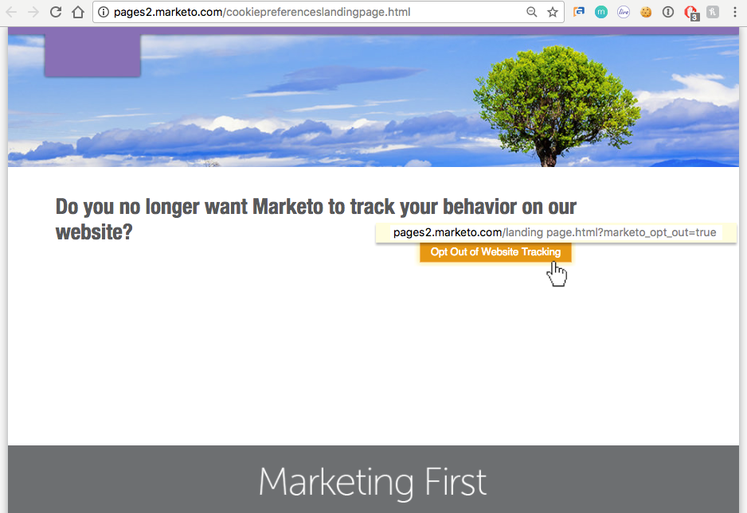
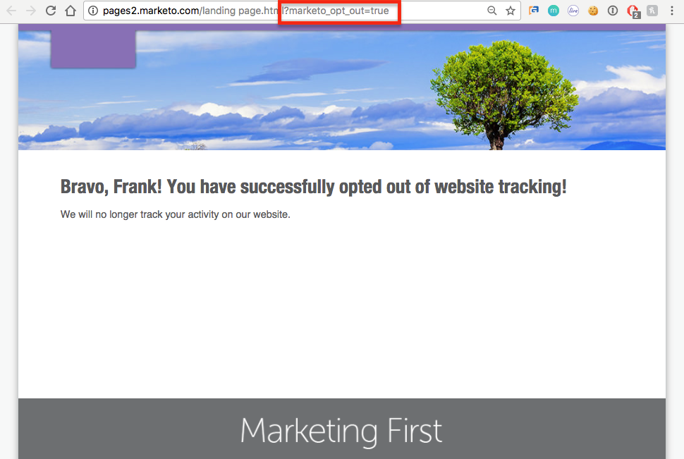
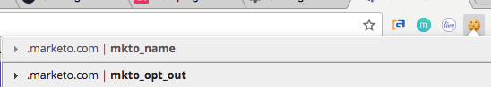

# プライバシー設定について {#understanding-privacy-settings}

## 概要 {#overview}

Marketo は、web 訪問者のトラッキングに対する同意をマーケターに提供します。 オプトアウトする方法は 2 つあります。また、匿名化した IP でトラッキングする方法を選択することもできます。

* Web 訪問者は、ブラウザーでトラッキング拒否（DNT）機能を選択します（マーケターは、web 訪問者のトラッキング拒否リクエストに従います）。
* Web 訪問者は、web サイトのマーケターによって提供されたオプトアウト cookie を使用します

または、マーケターは、匿名化した IP を使用してユーザーをトラッキングできます。

これらの方法は、特定の領域での Marketo の価値や機能に影響を与える可能性があります。 ただし、マーケター&#x200B;_がMarketoの設定を変更しない場合、Marketoの機能は変わりません。_

## トラッキング拒否のためのブラウザー設定 {#browser-settings-for-do-not-track}

Web 訪問者は、ブラウザーで「トラッキング拒否」（DNT）を選択することで、どの web サイトでもトラッキングされないように設定できます。 これにより、この特定のブラウザーおよびデバイスでのトラッキングを防ぐことができます。 詳しくは、ブラウザーのプライバシー設定を参照してください。

[!DNL Munchkin] では、マーケターは[ブラウザーの DNT 設定をサポートするか無視するかを決定](/help/marketo/product-docs/administration/settings/edit-do-not-track-browser-support-settings.md)することができます。

Web パーソナライゼーションでは、マーケターは[ブラウザーの DNT 設定をサポートするか無視する](/help/marketo/product-docs/web-personalization/getting-started/setting-web-personalization-to-do-not-track.md)かを決定することができます。

## 特定の web サイトからのオプトアウト {#opt-out-from-a-specific-website}

**ブラウザートラッキング拒否**&#x200B;設定の有無にかかわらず、サイト訪問者が web サイトからのトラッキングをオプトアウトできるようにすることも可能です。 これにより、サイト訪問者は、web サイトから直接トラッキング設定を指定できます。

これを行うには、[!DNL Munchkin] トラッキングが有効になっている web ページのオプトアウトリンクにパラメーターを追加する必要があります。 任意の web ページを指定できますが、web ページのリンクには以下のパラメーターを含める必要があります。

?marketo_opt_out=true

以下に、オプトアウトリンクおよびリンクがクリックされた後のランディングページを含む web ページの例を示します。 内容は次の通りです。

これは、オプトアウトリンクに「?marketo_opt_out=true」パラメーターがあるボタンがあるweb ページです。

「?marketo_opt_out=true」パラメーターを含むリンクがクリックされた場合のフォローアップページとして、ランディングページを作成して公開できます。

リンクがクリックされると、Marketo は **mkto_opt_out** という cookie を訪問者のブラウザーに追加し、上記のパラメーターでリンクをクリックしたサイト訪問者の [!DNL Munchkin] トラッキングを無効にするようにします。

Cookie を設置できることを検証するには、自分が cookie を設定したリードであることを確認し、リンクをクリックします。 次に、ブラウザーの cookie を参照して、**mkto_opt_out** cookie が追加されたことを確認します。

>[!NOTE]
>
>現在、これは [!DNL Munchkin] のバージョン 152 以降でのみ機能します。

## 参加 {#opt-in}

マーケターは、Marketo の機能を使用して、メール、フォーム、ランディングページなどの方法でユーザーがオプトインできるようにすることができます。

## 匿名化した IP を使用したトラッキング {#tracking-using-an-anonymized-ip}

マーケターは、匿名化した IP アドレスでユーザーをトラッキングすることで、プライバシーを保持できます。 これを行うには、このコードをWeb サイトに埋め込まれているRTPまたは[!DNL Munchkin] JavaScriptに追加します。

* [!DNL Munchkin]の場合、`{"anonymizeIP",true}`を[init関数](https://experienceleague.adobe.com/ja/docs/marketo-developer/marketo/javascriptapi/leadtracking/configuration){target="_blank"}に追加します。

* Web パーソナライゼーション（RTP）の場合は、これを javascript に追加します。

`anonymize IP : before calling rtp('send','view'); add rtp('set', 'settings', {'anonymizeIP' : true});`
