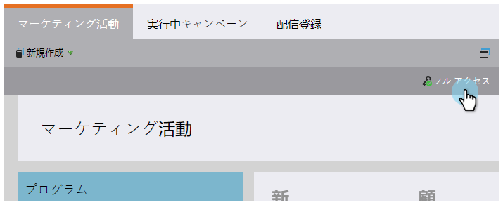

# {#find-out-what-permissions-you-have}の権限を調べる

Marketoでの権限の有無を疑問視している場合は、簡単に見つけることができます。

1. 「**マーケティングアクティビティ**」に移動します。

   

1. 「**フルアクセス**」をクリックして、権限を確認します。

   

1. このような権限が表示されます。

権限を有効にする必要がある場合は、マーケティング担当者にお問い合わせください。

