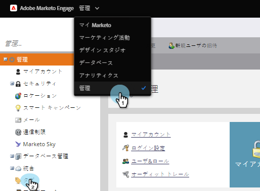

# 新しいプログラムタグとタグ値の作成{#create-a-new-program-tag-and-tag-values}

>[!NOTE]
>
>**必要な管理者権限**

プログラム用にカスタムの[タグ](/help/marketo/product-docs/core-marketo-concepts/programs/working-with-programs/understanding-tags.md)を作成し、タグに値を割り当てることができます。

>[!NOTE]
>
>**例**
>
>プログラムタグ：ターゲットオーディエンス
>
>プログラムタグの値：SMB、エンタープライズ、ミッドマーケット

1. 「**管理者**」で、「**タグ**」をクリックします。

   

1. 「**新規**」をクリックし、「**新しいタグの種類**」を選択します。

   

1. **タグタイプ**&#x200B;とタグ&#x200B;**値**&#x200B;を入力します。 次に、「**追加別の**」をクリックします。

   

1. 必要な数の値を入力します。 このタグを適用するプログラムのタイプを選択します。

   

   >[!TIP]
   >
   >複数のプログラムタイプを選択できます。 新しいプログラムが行われると、このタグタイプが使用可能になります。

1. 「**必須**」を選択し、「**作成**」をクリックします。

   

   >[!NOTE]
   >
   >タグタイプが&#x200B;**必須**&#x200B;の場合、新しいプログラムを作成する際にタグの値を入力する必要があります。

   

ユーザーがプログラムを作成する際、作成したタグのカスタム値を設定する必要があります。
