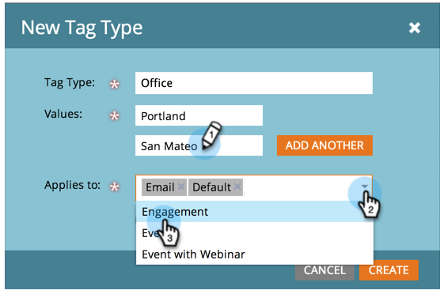

# プログラムタグとタグ値の新規作成 {#create-a-new-program-tag-and-tag-values}

>[!NOTE]
>
>**管理者権限が必要**

プログラム用にカスタム[タグ](/help/marketo/product-docs/core-marketo-concepts/programs/working-with-programs/understanding-tags.md)を作成し、値をタグに割り当てることができます。

>[!NOTE]
>
>**例**
>
>プログラムタグ：ターゲットオーディエンス
>
>プログラムタグ値：SMB、企業、中間市場

1. 「**[!UICONTROL 管理者]**」領域に移動します。

   

1. 「**[!UICONTROL タグ]**」をクリックします。

   

1. 「**[!UICONTROL 新規作成]**」をクリックして、「**[!UICONTROL 新規タグタイプ]**」を選択します。

   

1. **[!UICONTROL タグタイプ]**&#x200B;とタグ&#x200B;**[!UICONTROL 値]**&#x200B;を入力します。「**[!UICONTROL さらに追加]**」をクリックします。

   

1. 必要な数の値を入力します。このタグを適用するプログラムタイプを選択します。

   

   >[!TIP]
   >
   >複数のプログラムタイプを選択できます。新しいプログラムを作成すると、このタグタイプが使用可能になります。

1. 「**[!UICONTROL 必須]**」にチェックを入れて「**[!UICONTROL 作成]**」をクリックします。

   

   >[!NOTE]
   >
   >タグのタイプが&#x200B;**[!UICONTROL 必須]**&#x200B;の場合、ユーザは新しいプログラムを作成する際に、タグの値を入力する必要があります。

   

ユーザがプログラムを作成する際には、作成したタグのカスタム値を設定する必要があります。
