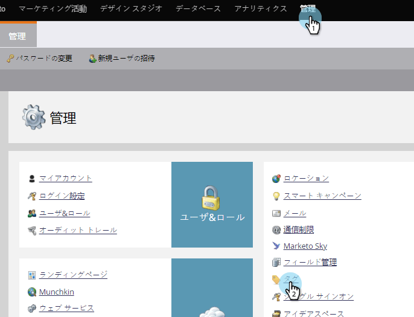
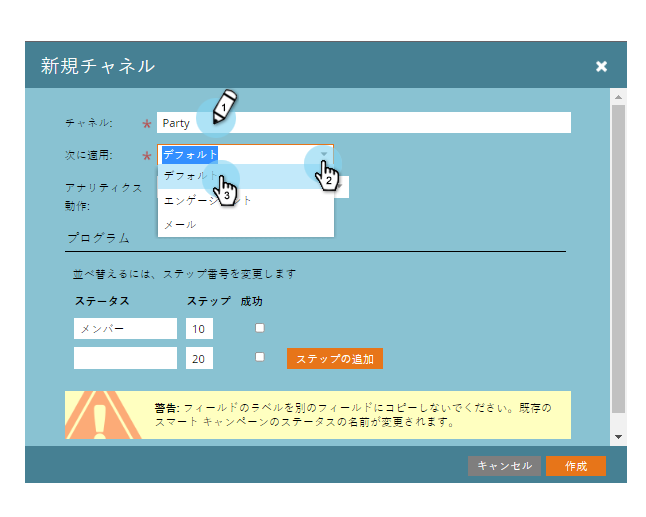
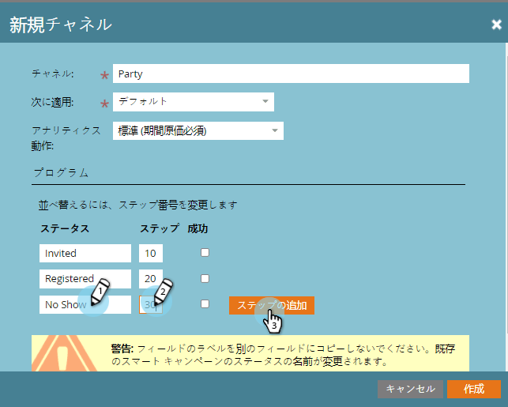

# プログラムチャネルの作成{#create-a-program-channel}

プログラムは、特定のマーケティングイニシアチブです。 このチャネルは、ウェビナーやスポンサーシップ、オンライン広告などの配信メカニズムを意図しています。

>[!NOTE]
>
>**必要な管理者権限**

>[!NOTE]
>
>**ディープダイブ**
>
>Marketoの最も重要な要素である[プログラム](http://docs.marketo.com/display/docs/programs)についての詳細。

1. 「**管理者**」セクションで、「**タグ**」をクリックします。

   

   >[!NOTE]
   >
   >なぜタグを？ チャネルは、他のタグと同様に、プログラムを記述する方法です。 チャネルには特別な機能があるだけです。

1. **チャネル**&#x200B;の横の&#x200B;**+**&#x200B;記号をクリックすると、展開して既存のチャネルを表示できます。

   

1. 「**新しい**」で、「**新しいチャネル**」をクリックします。

   

   >[!NOTE]
   >
   >**例**
   >
   >
   >チャネル:ビルボード
   >
   >    
   >    
   >    * 適用先：デフォルト
   >    * 進行状況：参加中（不確かな場合は、これらの作業は正常）
   >    * 成功：関与

   >    
   >    
   >チャネル:パーティ
   >
   >    
   >    
   >    * 適用先：イベント
   >    * 進行状況：招待、登録、ショーなし、出席
   >    * 成功：出席

   >    
   >    
   >既存のチャネルの進捗状況を調べて、その使用方法を確認してください。

1. パーティチャネルの例を見てみましょう。 新しい&#x200B;**チャネル**&#x200B;に名前を付け、適用するプログラムの種類を選択します。

   

   >[!NOTE]
   >
   >何を？ プログラムにはいくつかの種類があります。 チャネルを適切な型に一致させます。 不明な場合は、「**デフォルト**」を選択します。

   >[!NOTE]
   >
   >「ウェビナーとのイベント」を使用する場合、システムマッピングは、（ウェビナー統合の必要に応じて）ロックされ、編集できません。

   最初の2つのプログラムステータス名を入力し、追加「ステップ」をクリックします。
   

1. 別のプログラム&#x200B;**ステータス**&#x200B;と&#x200B;**ステップ**&#x200B;の番号を入力し、**追加ステップ**&#x200B;をクリックします。

   

   >[!TIP]
   >
   >**Step**&#x200B;番号は、プログラムのステータスの並べ替えに使用されます。 このような段階では人々は後ろ向きに進むことはできないことに注意してください ステータスを変更できるのは、より高いまたは等しい値のステータスのみです。 ステータスが進行ではなく前後に切り替わる場合は、等しい値を使用します。

1. 最後のプログラム&#x200B;**ステータス**&#x200B;と&#x200B;**ステップ**&#x200B;の番号を入力します。

   

   >[!NOTE]
   >
   >タイプ「イベント」を使用する場合は、「登録済み」、「Waitlisted」および「出席」のステータスのシステムマッピングが必要です。 したがって、これらのステータスを非表示にすることはできません。

1. **登録済み**&#x200B;の&#x200B;**モバイルチェックインステータス**&#x200B;を選択します。

   

1. **出席**&#x200B;の&#x200B;**モバイルチェックインステータス**&#x200B;を選択します。

   

   >[!NOTE]
   >
   >**モバイルチェックインステータス**** **オプションは、チャネルがイベントプログラムの場合にのみ使用できます。

   >[!NOTE]
   >
   >**Reminder**
   >
   >
   >**モバイルチェックインステータス******/（**登録**&#x200B;と&#x200B;**出席**）を持つ人のみが、[モバイルチェックインアプリ](http://docs.marketo.com/display/docs/events)に表示されます。

   >[!TIP]
   >
   >モバイルチェックインアプリで新しいユーザーが作成された場合、イベントプログラムで「登録済み」に設定されます。 ユーザーがアプリのイベントにチェックインされると、イベントプログラムで「出席」に設定されます。

1. 「**成功**」プログラムステータスを選択し、「**作成**」をクリックします。

   

   うまくいった！ そのタイプの新しいプログラムを作成すると、この新しいチャネルが選択肢の1つになります。

