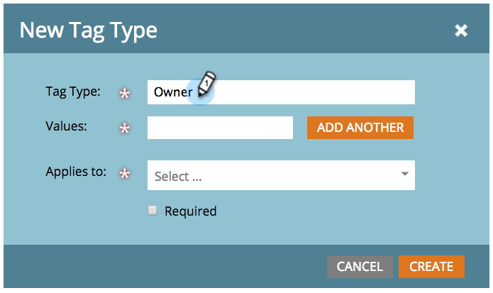
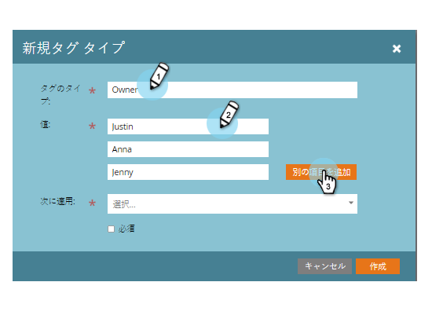

# カスタムタグの作成{#create-custom-tags}

タグはプログラムの整理に役立ちますが、チャネルはレポートのためのデータ収集に役立ちます。

>[!NOTE]
>
>**ディープダイブ**
>
>詳しくは、[タグ](../../../product-docs/core-marketo-concepts/programs/working-with-programs/understanding-tags.md)についてを参照してください。

>[!NOTE]
>
>**必要な管理者権限**

## 新しいタグタイプの作成{#create-a-new-tag-type}

新しいタグタイプを作成するには：

1. **管理者**&#x200B;セクションに移動します。

   

1. 「**タグ**」をクリックします。

   

1. 「**新規**」をクリックし、「**新しいタグの種類**」を選択します。

   

1. **タグタイプ**&#x200B;の名前を入力します。

   

1. 目的の&#x200B;**タグタイプの値**&#x200B;を入力します。 「**追加別の**」をクリックして、タグの値を追加入力します。

   

1. このタグを適用するプログラムのタイプを選択します。

   

   >[!NOTE]
   >
   >新しいプログラムが作成されたときにこのタグを追加するには、「**すべてのプログラム**&#x200B;に必須」を選択します。

1. 「**作成**」をクリックして保存します。

   

   それだ！ これで、プログラムのカスタムタグを作成できます。
