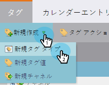
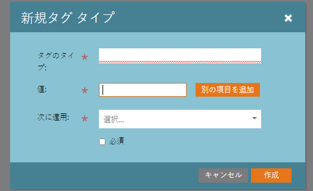
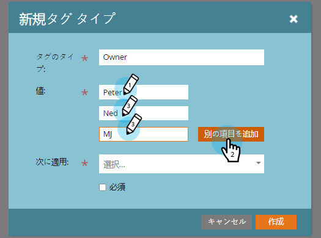
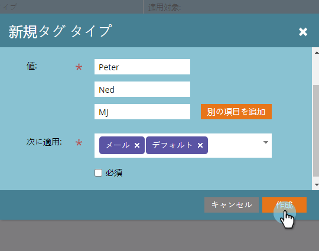

# カスタムタグの作成 {#create-custom-tags}

タグはプログラムの整理に役立ち、チャネルはレポート用にデータを収集する際に役立ちます。

>[!NOTE]
>
>詳しくは、[タグについて](/help/marketo/product-docs/core-marketo-concepts/programs/working-with-programs/understanding-tags.md)を参照してください。

>[!NOTE]
>
>**管理者権限が必要**

## 新しいタグタイプの作成 {#create-a-new-tag-type}

新しいタグタイプを作成する手順は次のとおりです。

1. 「**管理者**」セクションに移動します。

   

1. 「**タグ**」をクリックします。

   

1. 「**新規作成**」をクリックして、「**新規タグタイプ**」を選択します。

   

1. 「タグタイプ」の名前を入力します。

   

1. タグタイプの目的の「値」を入力します。「**さらに追加**」をクリックして、追加の値を入力します。

   

1. このタグを適用するプログラムタイプを選択します。

   

1. 一覧に表示されるすべてのプログラムタイプに対して、このタグを必須にするかどうかを決定します。

   

   >[!NOTE]
   >
   >* 新しいプログラムが作成されるたびにこのタグを追加する場合は、「必須」を選択します。
   >* 「適用先」リストからプログラムタイプを削除すると、タイプの既存プログラムからタグとその値が削除されます。既存のタグの値を保持し、このタグをオプションにして先に進み、_すべて_&#x200B;のプログラムタイプをリスト表示するには、「必須」チェックボックスを選択解除したままにします。

   >[!TIP]
   >
   >一部のプログラムタイプに対して必要な類似のタグを他のプログラムに対してオプションのタグにする場合は、それぞれ異なるプログラムタイプ（「必須」を選択したものと「必須」を選択しないもの）に適用する、2 つの異なるタグを設定する必要があります。

1. 「**作成**」をクリックします。

   
