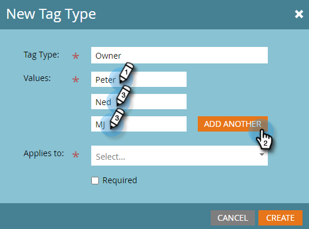

# カスタムタグの作成 {#create-custom-tags}

タグはプログラムの整理に役立ち、チャネルはレポート用にデータを収集する際に役立ちます。

>[!NOTE]
>
>詳しくは、[タグについて](/help/marketo/product-docs/core-marketo-concepts/programs/working-with-programs/understanding-tags.md)を参照してください。

>[!NOTE]
>
>**管理者権限が必要**

## 新しいタグタイプの作成 {#create-a-new-tag-type}

以下に、新しいタグタイプを作成する手順を示します。

1. 「**[!UICONTROL 管理者]**」セクションに移動します。

   

1. 「**[!UICONTROL タグ]**」をクリックします。

   

1. 「**[!UICONTROL 新規]**」をクリックして、「**[!UICONTROL 新規タグタイプ]**」を選択します。

   

1. 「タグタイプ」の名前を入力します。

   

1. タグタイプの目的の「値」を入力します。「**[!UICONTROL さらに追加]**」をクリックして、追加の値を入力します。

   

1. このタグを適用するプログラムタイプを選択します。

   

1. 一覧に表示されるすべてのプログラムタイプに対して、このタグを必須にするかどうかを決定します。

   

   >[!NOTE]
   >
   >* 新しいプログラムが作成されるたびにこのタグを追加する場合は、「[!UICONTROL 必須]」を選択します。
   >* 「[!UICONTROL 適用対象]」リストからプログラムタイプを削除すると、そのタイプの既存のすべてのプログラムからタグおよびその値が削除されます。既存のタグの値を保持し、このタグをオプションにして先に進み、_すべて_&#x200B;のプログラムタイプをリスト表示するには、「必須」チェックボックスを選択解除したままにします。

   >[!TIP]
   >
   >一部のプログラムタイプで必要な類似のタグを他のプログラムタイプではオプションにする場合、それぞれ異なるプログラムタイプに適用する、2 つの異なるタグを設定する必要があります（「[!UICONTROL 必須]」を選択したものと「[!UICONTROL 必須]」を選択しないもの）。

1. 「**[!UICONTROL 作成]**」をクリックします。

   
