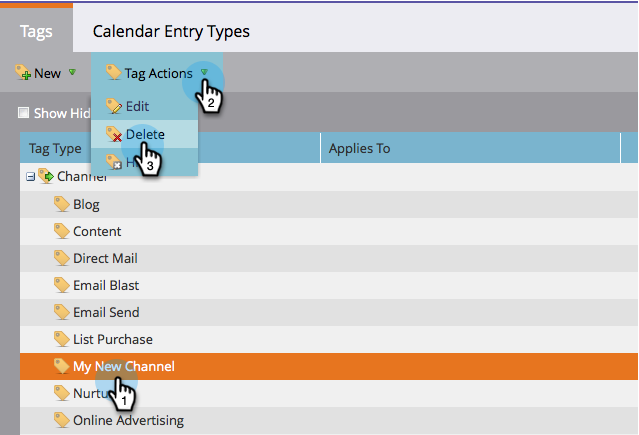

# プログラムチャネルの削除{#delete-a-program-channel}

プログラムチャネルは、プログラム内で行う必要のあるステータスまたはチェックポイントのリードの集まりです。

誤って作成した場合や不要になった場合は、削除できます。

1. **管理者**&#x200B;セクションに移動します。

   

1. 「**タグ**」をクリックします。

   

1. 削除するチャネルを選択し、「タグ付けアクション」で、「削除」をクリックします。

   >[!TIP]
   >
   >チャネルが任意のプログラムに関連付けられている場合、削除はできず、非表示にするだけです。

   

バム！ また、チャネル](/help/marketo/product-docs/administration/tags/delete-a-program-status-from-a-program-channel.md)から特定のステータスを[削除することもできます。
