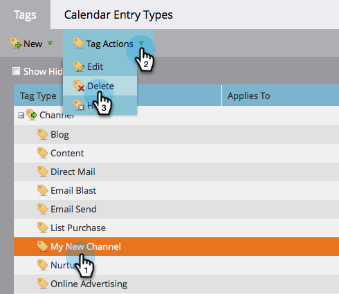

# プログラムチャネルの削除 {#delete-a-program-channel}

プログラムチャネルは、プログラム内で閲覧する必要のあるステータスまたはチェックポイントのリードの集まりです。

誤って作成した場合や不要になった場合は、削除できます。

1. 「**管理者**」領域に移動します。

   

1. 「**タグ**」をクリックします。

   

1. 削除するチャネルを選択し、「タグのアクション」で「削除」をクリックします。

   >[!TIP]
   >
   >チャネルがプログラムに関連付けられている場合、非表示にすることはできますが、削除はできません。

   

完了です。また、[チャネルから特定のステータスを削除する](/help/marketo/product-docs/administration/tags/delete-a-program-status-from-a-program-channel.md)こともできます。
