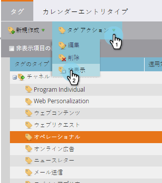

# プログラムチャネルを非表示/再表示{#hide-unhide-a-program-channel}

>[!NOTE]
>
>**必要な管理者権限**

プログラムチャネル[がプログラムで使用されていない場合は、&lt;a0/>削除できます。  ](delete-a-program-channel.md)しかし、一度使えば、そのままにしておく必要があります。  ただし、不要になった場合は非表示にすることができます。

## プログラムチャネルを非表示にする{#hide-a-program-channel}

1. 「**管理者**」で、「**タグ**」をクリックします。

   

1. 「**チャネル**」ドロップダウンをクリックし、「**チャネル**」を選択して非表示にします。

   

1. 「**タグのアクション**」で、「**隠す**」をクリックします。

   

落ち着け、落ち着け！

## プログラムチャネルの再表示{#unhide-a-program-channel}

1. 「非表示を表示」チェックボックスをオンにして、プログラムチャネルを再表示します。

   

落ち着け、落ち着け！ (それは本当の式ですか？)
