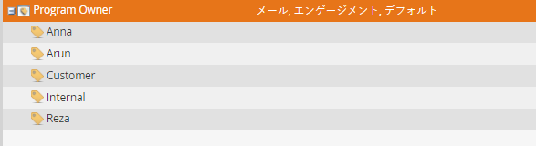

# タグ値の管理 {#managing-tag-values}

[タグ](../../../product-docs/core-marketo-concepts/programs/working-with-programs/understanding-tags.md) は、プログラムを記述するために使用されます。 必要な数だけ作成でき、それぞれに一意の値を設定できます。 これらの値の管理方法を次に示します。

>[!NOTE]
>
>**必要な管理者権限**

>[!NOTE]
>
>**前提条件**
>
>[新しいプログラムタグとタグ値の作成](create-a-new-program-tag-and-tag-values.md)

## タグ値の追加 {#adding-tag-values}

1. 「 **管理者**」の下にある「 **タグ**」をクリックします。

   

1. 「**新規**」をクリックし、「 **新しいタグ値**」をクリックします。

   

1. 「 **タグの種類**」を選択します。

   

1. **値を入力し** 、「 **別の値**」をクリックします。 値は必要な数だけ追加できます。

   

1. 残り追加の値を選択し、「 **作成**」をクリックします。

   

1. 変更はすぐに表示されます。

## タグ値の非表示 {#hiding-tag-values}

タグは古いプログラムで使用される場合があります。 タグタイプを非表示にすると、後で使用するために非推奨とすることができます。

1. 「** ****タグ** 」を選択し、非表示にする **値を選択します** 。

   

1. 「 **タグ付けアクション**」で、「 **非表示」を選択します**。

   

## 非表示の値を表示 {#show-hidden-values}

非表示の値を再度表示するには、次の操作を行います。

1. 「非表示を表示」ボックスを選択します。 チェックすると、非表示の値を表示できます。

   

   その後、将来使用する値を再表示できます。

