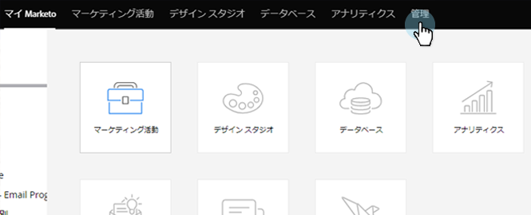
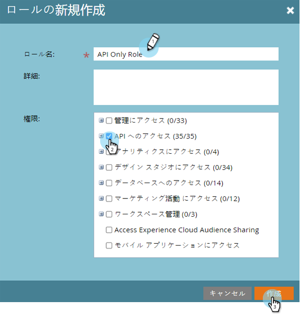

# API のみのユーザーの役割を作成する {#create-an-api-only-user-role}

[REST API](https://developers.marketo.com/documentation/rest/) を使用して Marketo と統合する場合、ベストプラクティスは[ユーザーに API のみの役割](/help/marketo/product-docs/administration/users-and-roles/create-an-api-only-user.md)を割り当て、使用するカスタムサービスを [REST API](/help/marketo/product-docs/administration/additional-integrations/create-a-custom-service-for-use-with-rest-api.md) で作成することです。API のみのユーザーの役割を作成する方法を以下に示します。

>[!NOTE]
>
>**管理者権限が必要です**

1. My Marketo で、「**管理者**」をクリックします。

   

1. 「セキュリティ」で「**ユーザーと役割**」をクリックします。

   

1. 「**役割**」タブをクリックしてから、「**新規の役割**」をクリックします。

   

1. 「役割名」を入力し、付与する API 権限を「権限」から選択して、「**作成**」をクリックします。

   

>[!TIP]
>
>必要な最小限の権限のみを付与することをお勧めします。

>[!MORELIKETHIS]
>
>できましたね。次に、[API のみのユーザー](/help/marketo/product-docs/administration/users-and-roles/create-an-api-only-user.md)を作成します。
