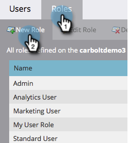
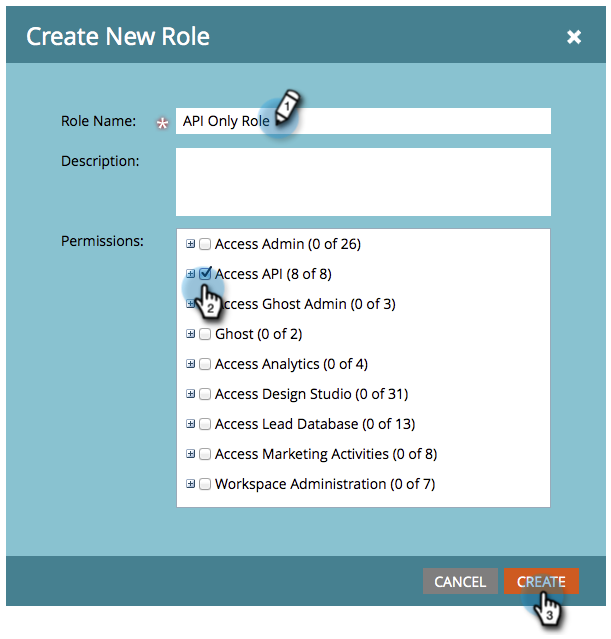

# API 専用ユーザーロールの作成 {#create-an-api-only-user-role}

[REST API](https://experienceleague.adobe.com/ja/docs/marketo-developer/marketo/rest/rest-api) を使用して Marketo と統合する場合、ベストプラクティスは[ユーザに API のみのロール](/help/marketo/product-docs/administration/users-and-roles/create-api-only-user.md)を割り当て、[使用するカスタムサービスを REST API で作成](/help/marketo/product-docs/administration/additional-integrations/create-a-custom-service-for-use-with-rest-api.md)することです。 次の手順では、APIのみのユーザーロールを作成する方法について説明します。

>[!NOTE]
>
>**管理者権限が必要**

1. 「**[!UICONTROL 管理者]**」領域に移動します。

   

1. 「**[!UICONTROL ユーザー＆ロール]**」をクリックします。

   

1. 「**[!UICONTROL ロール]**」タブをクリックしてから、「**[!UICONTROL 新規ロール]**」をクリックします。

   

1. 「ロール名」を入力し、付与する API 権限を「権限」から選択して、「**[!UICONTROL 作成]**」をクリックします。

   

>[!TIP]
>
>必要な最小権限を常に付与します。

>[!MORELIKETHIS]
>
>次に、[APIのみのユーザー](/help/marketo/product-docs/administration/users-and-roles/create-api-only-user.md)を作成します。
