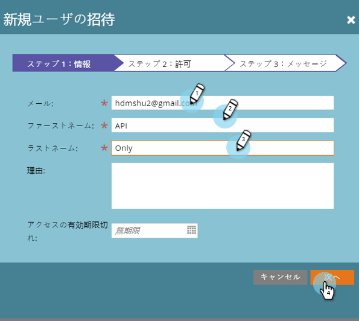

# APIのみのユーザーの作成 {#create-an-api-only-user}

[REST APIを介してMarketoと統合する場合は、APIのみのユーザーを作成する必要があります](http://developers.marketo.com/documentation/rest/)。 これが方法です。

>[!PREREQUISITES]
>
>* [APIのみのユーザーロールの作成](create-an-api-only-user-role.md)

>

>[!NOTE]
>
>**必要な管理者権限**

1. 「 **管理者**」の下にある「 **ユーザーとロール」をクリックします。**

   

1. 「 **新しいユーザーを招待**」をクリックします。

   

1. APIのみのユーザーに対して電子メール、名、姓を入力します。 「 **次へ**」をクリックします。

   

   >[!TIP]
   >
   >追加オプションの理由またはアクセスの有効期限。 アクセス有効期限は、短期間の従業員に便利です。

1. 「 **APIのみ** 」ロールを選択し、「 **APIのみ** 」チェックボックスをオンにします。 「 **次へ**」をクリックします。

   

1. 「 **送信**」をクリックします。

   

>[!NOTE]
>
>ポップアップには「APIだけに招待は必要ありません」と表示されますが、これは何か間違ったことをしたとは限りません。 これは、招待用の電子メールを送信しないでロールを作成することを意味します。

よし！ 次に、カスタムサービスを作成します。

>[!NOTE]
>
>**関連記事**
>
>* [ReST APIで使用するカスタムサービスの作成](../../../product-docs/administration/additional-integrations/create-a-custom-service-for-use-with-rest-api.md)

>

