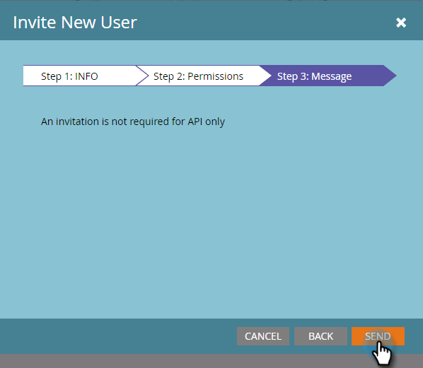

# API 専用ユーザーの作成 {#create-an-api-only-user}

[REST API](https://developers.marketo.com/documentation/rest/) を使用して Marketo と統合する場合は、API 専用ユーザーを作成する必要があります。手順は以下のとおりです。

>[!PREREQUISITES]
>
>[API 専用ユーザーの役割の作成](/help/marketo/product-docs/administration/users-and-roles/create-an-api-only-user-role.md)

>[!NOTE]
>
>**管理者権限が必要**

1. 「**管理者**」領域に移動します。

   

1. 「**ユーザ＆ロール**」をクリックします。

   

1. 「**新しいユーザを招待**」をクリックします。

   

1. API 専用ユーザーの電子メール、名、姓を入力します。「**次へ**」をクリックします。

   

   >[!TIP]
   >
   >理由（オプション）またはアクセスの有効期限を追加します。短期の従業員には、アクセスの有効期限が便利です。

1. 「**API のみ**」の役割を選択し、「**API のみ**」チェックボックスをオンにします。「**次へ**」をクリックします。

   

1. 「**送信**」をクリックします。

   

>[!NOTE]
>
>ポップアップに「招待状は API にのみ必要なものではありません」と表示されますが、何か間違ったことをしたわけではありません。招待メールを送信しなくても役割が作成されるという意味です。

よろしいですか。先に進んでカスタムサービスを作成しましょう。

>[!MORELIKETHIS]
>
>[ReST API で使用するカスタムサービスの作成](/help/marketo/product-docs/administration/additional-integrations/create-a-custom-service-for-use-with-rest-api.md)
