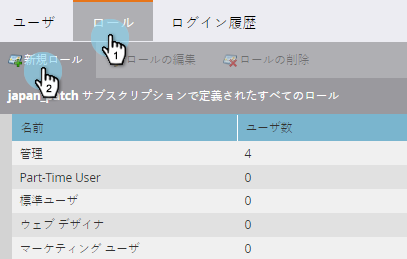
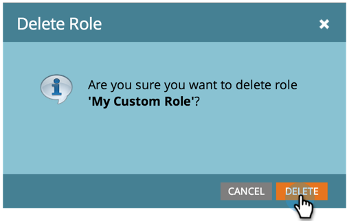

# ユーザーロールの作成、削除、編集および変更 {#create-delete-edit-and-change-a-user-role}

**役割** ：複数の権限をグループ化します。 **権限設定を使用すると** 、Marketoで操作を行うことができます。 ユーザーに **ロールをアサインします** 。 簡単。

>[!NOTE]
>
>**必要な管理者権限**

## ロールの作成 {#create-a-role}

1. 「**管理者**」に移動し、「 **ユーザーとロール**」をクリックします。

   

1. 「** Roles」タブ**に移動し、「 **New Role**」をクリックします。

   

1. 新しいロールの名前を付け、そのロールに関連付けられたユーザーに付与するすべての権限をチェックし、「 **作成**」をクリックします。

   

## ロールの削除 {#delete-a-role}

1. 「管理者」で、** **「 **ユーザーとロール**」をクリックします。

   

1. 「**Roles **」タブで、ロールを選択し、「ロールを **削除**」をクリックします。

   

1. 「 **削除**」をクリックして、削除を確定します。

   

>[!NOTE]
>
>ロールにユーザーが割り当てられていないことを確認する必要があります。割り当てられていない場合、ロールを削除できません。

## 既存のロールの編集 {#edit-an-existing-role}

>[!NOTE]
>
>独自のユーザの役割を編集するには、管理者権限を持つ別のユーザとしてログインする必要があります。

1. 「 **管理者** 」に移動し、「 **ユーザーとロール**」をクリックします。

   

1. 「**ロール**」タブをクリックします。

   

1. 編集するロールを選択し、「**ロールを編集**」をクリックします。

   

1. 必要な変更をすべて行い、「 **保存**」をクリックします。

   

   >[!NOTE]
   >
   >ロールに対する変更は、このロールに関連付けられているすべてのユーザーに影響を与えます。

   >[!TIP]
   >
   >アカウントの電子メールアドレスを更新しますか？ [こちらをご覧ください](http://docs.marketo.com/x/3wFI)。

## ユーザーの役割の変更 {#change-a-users-role}

1. 「 **管理者** 」に移動し、「 **ユーザーとロール**」をクリックします。

   

1. 別のロールを割り当てるユーザーを選択し、「 **Edit User」をクリックします。**

   

1. 前の役割のチェックを外し、新しい役割を選択して、「 **保存**」をクリックします。

   

>[!NOTE]
>
>複数のロールを選択したままにした場合、Marketorは、最も厳しい権限をデフォルトに設定します。

すごい今は本当に楽勝だ！  （わかる？）