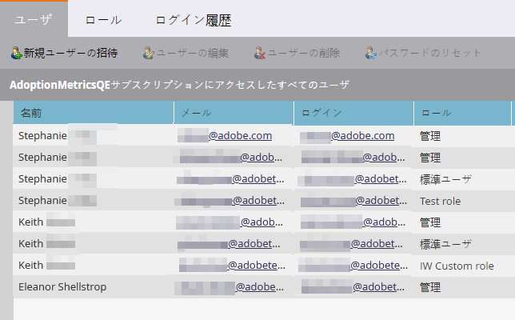
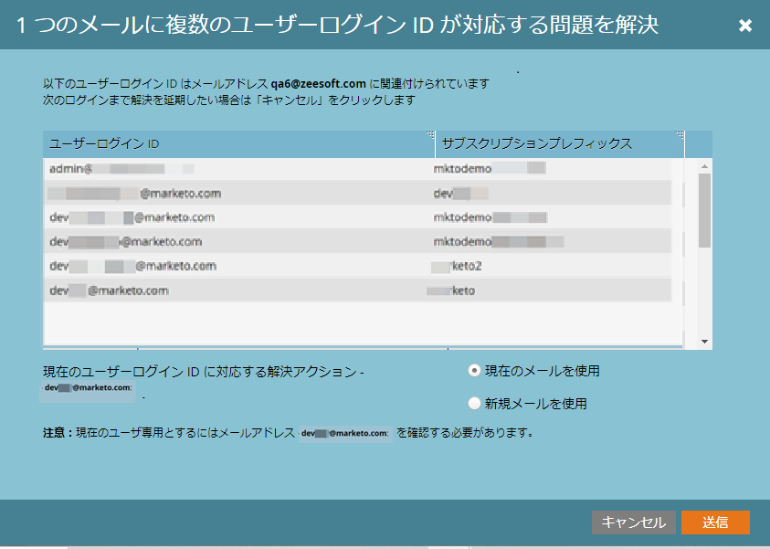

# メールの検証 {#email-verification}

Adobe Marketo Engageサブスクリプションを使用する場合、Marketo Engage管理者を含む、API 以外のすべてのユーザーが電子メールアドレスを検証する必要があります。 管理者の役割が割り当てられていない、または「SSO のバイパス」権限を持つ役割が割り当てられたシングルサインオン (SSO) ユーザーは、電子メールの検証機能で配信が有効になると、自動的に電子メールを検証します。

## この機能が導入された理由 {#why-this-feature-was-introduced}

Marketo Engageは、AdobeID へのユーザーの移行を含め、Adobeビジネスプラットフォームへの顧客の移行に備えて、電子メールの検証の展開を継続しています。 この機能は、既存のユーザーアカウントのセキュリティをMarketo Engageにします。 Marketo Engageユーザーが適切なAdobe IDに確実に関連付けられるように、既存のMarketo Engageユーザーは電子メールアドレスを検証する必要があります。 Marketo EngageをAdobe IDに移行するには、検証済みの E メールアドレスが必要です。 Marketo Engageユーザーが E メールアドレスを検証しない場合、そのユーザーはAdobe IDに移行できず、サブスクリプションのユーザー移行が完了した後でMarketoサブスクリプションにアクセスできなくなります。

## ユーザ招待 {#user-invite}

管理者がユーザを招待した場合、招待リンクをクリックすると、そのユーザは自動的に検証されます。管理者の役割が割り当てられていない SSO ユーザーは、自動的に検証されます。

## 確認メール {#verification-email}

サブスクリプションの電子メール検証が有効化されたとき、または管理者/ユーザーによってトリガーされたときに、ユーザーは次の電子メールを受け取ります。

>[!NOTE]
>
>未検証のユーザに検証メールを再送信するには、レコードを選択し、「**[!UICONTROL メールを確認]**」ボタンをクリックします。

## メールアドレスの変更 {#changing-an-email-address}

ユーザのメールアドレスが変更されると、そのメールアドレスは検証されなくなります。再検証を許可するメールが送信されます。ユーザは、「**[!UICONTROL 検証を再送信]**」をクリックして、手動でメールを再送できます。

## ユーザとロール {#users-and-roles}

In **[!UICONTROL 管理者]** > **[!UICONTROL ユーザーとロール]**「 E メールステータス」列には、各ユーザーの検証ステータスが表示されます。

## 複数のユーザーログイン ID {#multiple-user-login-ids}

1 つの電子メールアドレスに関連付けることができるユーザーアカウントは 1 つだけです。 1 つの電子メールアドレスに複数のMarketo Engageアカウントが関連付けられている場合、競合を解決し、その電子メールアドレスに関連するすべてのユーザーログインと 3 つの解決オプションを表示する必要があります。

* 現在のユーザーログイン ID に対して現在の電子メールを使用
* 現在のユーザーログイン ID に新しい電子メールを使用
* 次回のログインまで決定を遅延

  

>[!NOTE]
>
>ユーザーアカウントは 1 つのアドレスに関連付ける必要がありますが、ユーザーアカウントはユニバーサル ID を介して多くのサブスクリプションで使用できます。
