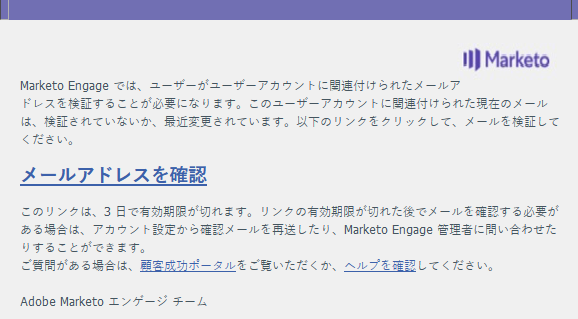
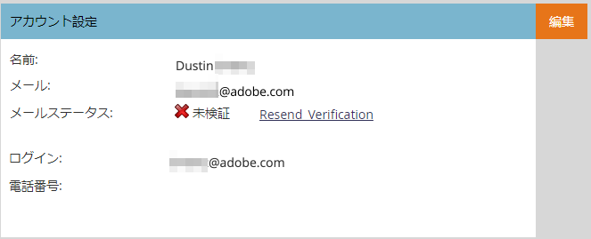
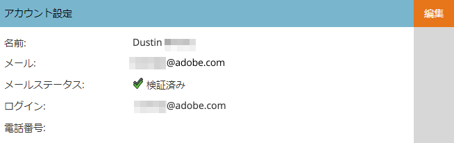

# メールの検証 {#email-verification}

AdobeMarketo Engageのサブスクリプションを使用する場合、API 以外のすべてのユーザーは、自分の電子メールアドレスを検証する必要があります。 シングルサインオン (SSO) ユーザーは、メールの検証でサブスクリプションが有効になっている場合、自動的にメールを検証します。

**ユーザー招待**

管理者がユーザーを招待した場合、招待リンクをクリックすると、そのユーザーは自動的に検証されます。 SSO を持つユーザーは自動的に検証されます。

**メールアドレスの変更**

ユーザーの電子メールアドレスが変更されると、その電子メールアドレスは検証されなくなります。 再検証を許可するメールが送信されます。 管理者は、 **検証を再送信**.

**ユーザーと役割**

管理者/ユーザーと役割で、「電子メールのステータス」列に各ユーザーの検証ステータスが表示されます。

未検証のユーザーを検証するには、レコードを選択し、 **メールの確認** 」ボタンをクリックします。
