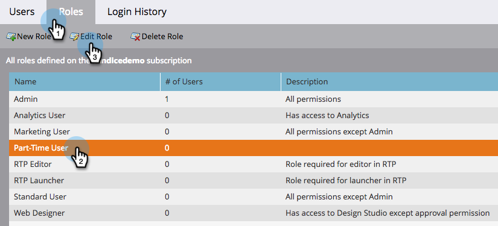

# スニペットで「ドラフトなし」を有効にする {#enable-no-draft-for-snippets}

スニペットで「ドラフトなし」を有効にすると、スニペットを使用する承認済みアセットのドラフトなしでスニペットの変更を配布できます。編集済みのスニペットを使用するすべてのアセットが更新を受け取り、それぞれのステータスを維持します。

* 承認済みアセットはスニペットの更新を取得し、承認は維持されます

* ドラフトはスニペットの更新を取得し、ドラフトモードは維持されます

「ドラフトなし」は、すべての管理者の役割に対して自動的に有効になります。その後、管理者は、その他の役割に対してこの機能を有効にできます。

>[!NOTE]
>
>**管理者権限が必要**

1. 「**管理者**」領域に移動します。

   

1. 「**ユーザ＆ロール**」をクリックします。

   

1. 「**役割**」タブに移動し、役割を選択して「**役割を編集**」をクリックします。

   

1. 「**Design Studio にアクセス**」オプションを展開します。

   

1. 「**スニペットにアクセス**」オプションを展開します。

   

1. 「**スニペットを承認**」権限を展開し、「**ドラフトなし**」ボックスにチェックを入れます。「**保存**」をクリックします。

   

>[!TIP]
>
>「ドラフトなし」を無効にするには、上記の手順 1～4 に従い、「ドラフトなし」チェックボックスをオフにして、「**保存**」をクリックします。

>[!MORELIKETHIS]
>
>[「ドラフトなし」でのスニペットの承認](/help/marketo/product-docs/personalization/segmentation-and-snippets/snippets/approve-a-snippet-with-no-draft.md)
