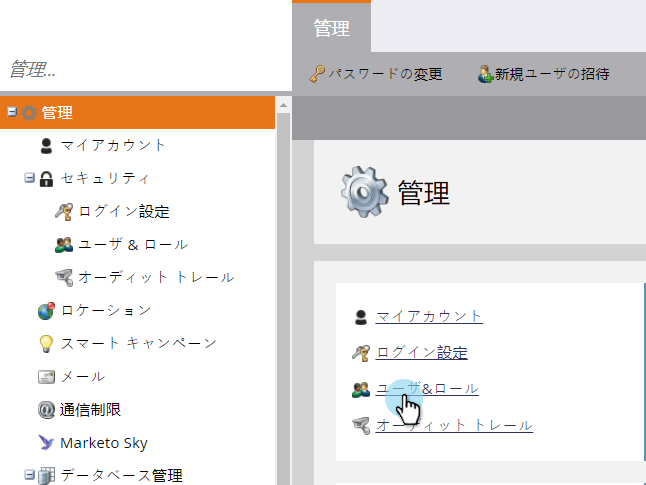

# 役割に対する詳細なリストのインポート権限を有効にする {#enable-the-advanced-list-import-permission-on-a-role}

リストのインポートモードは、「詳細なリストのインポート」権限が有効になっている役割を持つユーザーのみが使用できます。他のすべてのユーザーは、人物のリストをインポートする際に、「リストのインポートモード」ドロップダウンが表示されず、インポートするリストはデフォルトで通常のインポートモードに設定されます。

>[!NOTE]
>
>**管理者権限が必要**

1. 「**管理者**」に移動します。

   

1. 「**ユーザーと役割**」をクリックします。

   

1. 「**役割**」タブで、変更する役割を選択し、「**役割を編集**」をクリックします。

   

1. 「データベースにアクセス」で、「**詳細なリストのインポート**」にチェックを入れ、次に、「**保存**」をクリックします。

   

これで完了です。編集した役割に関連付けられているすべてのユーザーで、詳細なリストのインポートオプションが有効になります。
