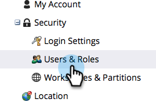

# ユーザーと役割のリストのエクスポート {#export-a-list-of-users-and-roles}

>[!NOTE]
>
>**管理者権限が必要**

ユーザーとユーザーの役割の完全なリストをエクスポートするのは非常に簡単です。手順は以下のとおりです。

1. 「**管理者**」に移動します。

   

1. 「**ユーザーと役割**」をクリックします。

   

1. エクスポートする前に、列を追加または削除します。

   >[!TIP]
   >
   >ロールをエクスポートするには、 **役割** 「 」タブから、次に「エクスポート」を選択します。

   

1. 「**エクスポート**」アイコンをクリックします。

   

   以上です。新しい Excel ファイルをダウンロードする必要があります。

   
