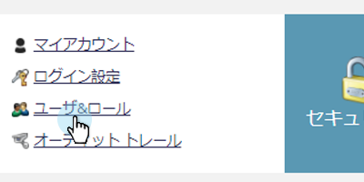

# 役割と権限のエクスポート {#export-roles-and-permissions}

すべての役割とその権限をエクスポートする方法を説明します。

>[!NOTE]
>
>管理者権限が必要

1. My Marketo で、「**管理者**」をクリックします。

   

1. 「**ユーザーと役割**」を選択します。

   

1. 「**役割**」タブをクリックします。

   

1. ページの下部までスクロールし、「エクスポート」ボタンをクリックします。

   

>[!NOTE]
>
>ブラウザーが Marketo からのポップアップをブロックしていないことを確認します。

データは CSV 形式でエクスポートされ、役割、権限、グループごとに有効にされた権限の数が含まれます。

