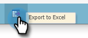

# ロールと権限のエクスポート {#export-roles-and-permissions}

すべてのロールとその権限をエクスポートする方法を説明します。

>[!NOTE]
>
>管理者権限が必要

1. 「**[!UICONTROL 管理者]**」領域に移動します。

   

1. 「**[!UICONTROL ユーザー＆ロール]**」を選択します。

   

1. 「**[!UICONTROL ロール]**」タブをクリックします。

   

1. ページの下部までスクロールし、「エクスポート」ボタンをクリックします。

   

>[!NOTE]
>
>ブラウザーが Marketo からのポップアップをブロックしていないことを確認します。

データは CSV 形式でエクスポートされ、ロール、権限、グループごとに有効にされた権限の数が含まれます。

