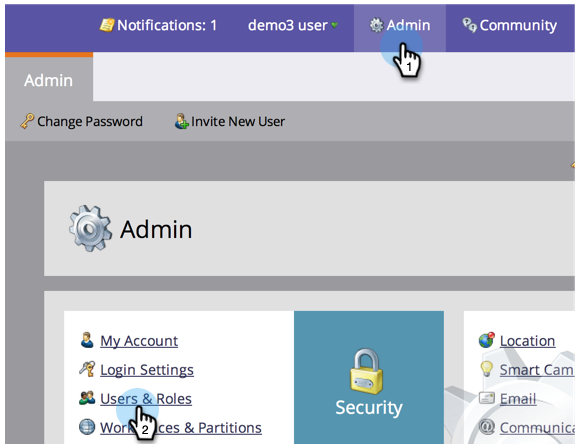
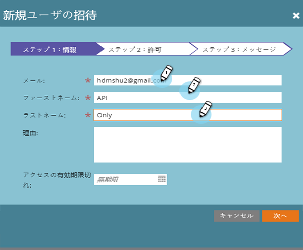
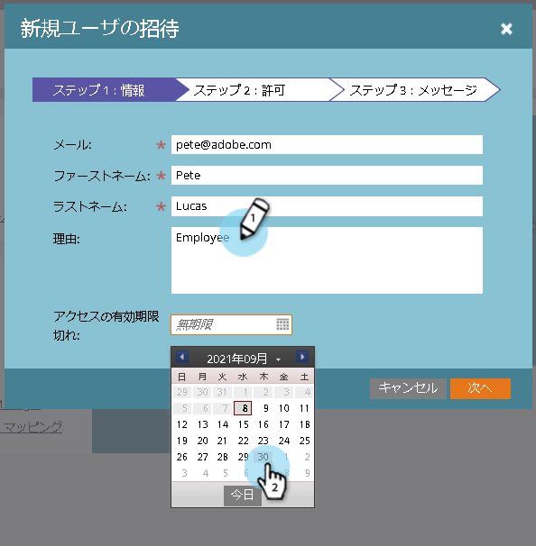
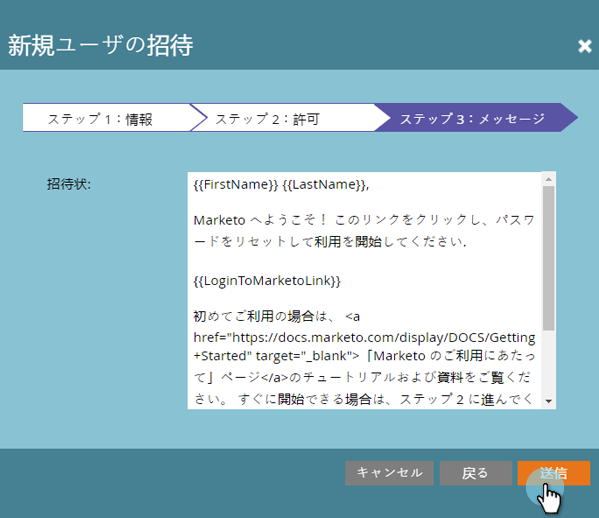
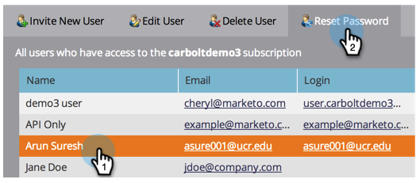

# マーケティングユーザーの管理 {#managing-marketo-users}

## ユーザーの作成 {#create-users}

1. 「 **管理者** 」に移動し、「 **ユーザーとロール**」をクリックします。

   

1. 「 **新しいユーザーを招待**」をクリックします。

   

1. 「 **電子メールアドレス**」、「 **名**」、「**姓」を入力します。**

   ** 

   **

1. 必要に応じて、招待の理由を入力し、日付選択を使用して「 **アクセスの有効期限** 」フィールドに有効期限を選択します。

   

1. 「 **次へ**」をクリックします。

   

   >[!TIP]
   >
   >有効期限は、短期間のみマーケティングへのアクセスを必要とする、外部の関係者またはコンサルタントに適しています。

   >[!NOTE]
   >
   >有効期限が到達すると、ユーザーは有効期限の通知を受け取り、アカウントがロックされます。

1. 任意の「**ロール**」を選択し、「 **次へ**」をクリックします。

   

1. 必要に応じて、招待メッセージを編集します。 「 **送信**」をクリックします。

   

   >[!NOTE]
   >
   >電子メール/ログインは一意である必要があります。サンドボックスインスタンスで既に使用している場合は、実稼働環境では別のインスタンスを使用し、逆も同じである必要があります。

   

   >[!NOTE]
   >
   >招待は、新しいユーザーが追加されてから3日後に期限切れになります。

これで、新しいユーザーが「ユーザー」タブに表示され、アカウントのアクティベーション方法に関する手順が記載された電子メールが届きます。

## ユーザーの削除 {#delete-users}

1. 「管理者」に移動し、「ユーザーとロール」をクリックします。

   

1. 削除するユーザーを選択し、「ユーザーを削除」をクリックします。

   

1. 「OK」をクリックして確認します。

   

## ユーザーパスワードのリセット {#reset-user-passwords}

1. 「管理者」に移動し、「ユーザーとロール」をクリックします。

   

1. ユーザーを選択し、「パスワードをリセット」をクリックします。

   

1. 「閉じる」をクリックしてプロンプトを閉じます。

   

パスワードのリセット手順が記載された電子メールがユーザーに送信されます。

>[!TIP]
>
>ユーザーの受信トレイに電子メールが表示されない場合は、迷惑メール/スパムフォルダーを確認するように依頼します。

## 権限の変更とユーザー情報の編集 {#change-permissions-and-edit-user-information}

1. 「 **管理者** 」に移動し、「 **ユーザーとロール」をクリックします。**

   

1. ユーザーを選択し、「 **Edit User**」をクリックします。

   

1. ユーザー情報を編集し、関連付けられたロールを変更できます。 「 **保存**」をクリックします。

   

>[!CAUTION]
>
>Marketingの唯一の管理者である場合は、自分の管理者権限を削除しないように注意してください。

>[!NOTE]
>
>新しいユーザーが管理者として招待された場合、または管理者が削除された場合、現在のすべての管理者に電子メール通知が送信されます。

すごい仕事！ これで、ユーザーの作成、ユーザーの削除、ユーザーのパスワードのリセットおよびユーザーの編集の方法が理解できました。
