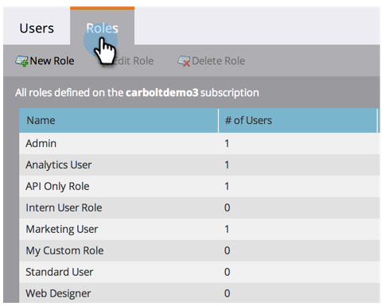
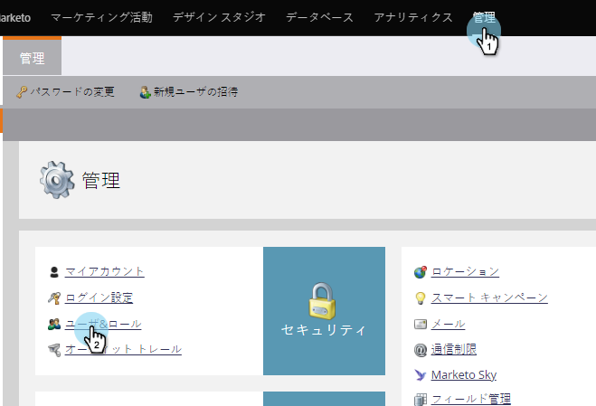
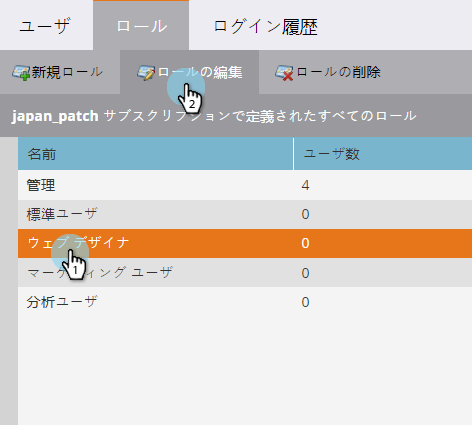
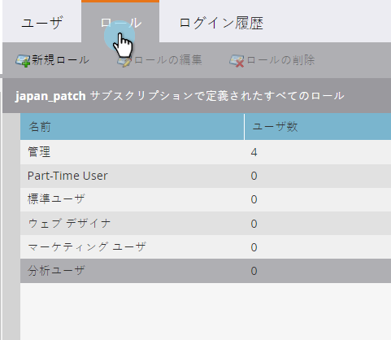

# ユーザーの役割と権限の管理 {#managing-user-roles-and-permissions}

ユーザーロールを設定、作成および編集し、ユーザーに割り当てます。 これにより、各マーケティングユーザーがアクセスできる領域と機能を制御できます。

例えば、マーケティングユーザーは通常、電子メール、ランディングページおよびプログラムを作成、変更およびデプロイするために、アプリ全体に広いアクセス権が必要です。 一方、Webデザイナーは、ほとんどの時間をDesign Studioで過ごし、電子メールやランディングページで使用するアセットを作成します。 また、会社リーダーはAnalytics領域にあるMarketing Toのレポートを広範囲に活用していますが、アセットやプログラム自体を作成または駆動する必要がない場合があります。

>[!NOTE]
>
>**必要な管理者権限**

Marketorには、様々なレベルのアクセスを持つ組み込みの役割が用意されています。

* **管理者** - 「管理者」セクションを含む、アプリケーションのすべての部分
* **標準ユーザー** — 管理セクションを除く、アプリケーションのすべての部分
* **マーケティングユーザー** - 「管理者」セクション以外のアプリのすべての部分
* **Web Designer **- Design Studioのみ
* **Analyticsユーザー**- Analyticsセクションのみ

管理者ロールと標準ユーザーロールは編集できませんが、その他のロールは編集できます。 また、会社内の特定の組織構造に合わせて、新しいカスタムロールを作成することもできます。

## ユーザーへのロールの割り当て {#assign-roles-to-a-user}

ユーザーを初めて [作成するとき](http://docs.marketo.com/display/DOCS/Create%2C+Delete%2C+Edit+and+Change+a+User+Role) 、または既存のユーザーを [編集するときに、ユーザーにロールをアサインできます](managing-marketo-users.md)。

1. 既存のユーザーを編集するには、「 **管理者** 」に移動し、「 **ユーザーとロール**」をクリックします。

   

1. リストから、編集するユーザを選択し、「 **Edit User**」をクリックします。

   

1. 「 **Roles**」で、必要な権限に基づいて、ユーザーに割り当てるロールを選択し、「 **Save**」をクリックします。

   

   >[!NOTE]
   >
   >各ロールについて詳しくは、「ロール権限の [説明](managing-user-roles-and-permissions/descriptions-of-role-permissions.md)」を参照してください。

## 新しいロールの作成 {#create-a-new-role}

場合によっては、組織に非常に特定の役割を持つ従業員がいて、権限のカスタムの組み合わせを必要とすることがあります。

1. 新しいユーザーロールを作成するには、「管理者」に移動し、「ユーザーとロール」をクリックします。

   

1. 「ロール」タブをクリックします。

   

1. 「新しいロール」をクリックします。

   

1. 「ロール名」、「説明」（オプション）を入力し、このロールのユーザーに必要な権限を選択します。

   

## ロールの編集 {#edit-a-role}

既存のロールに関連付けられている権限を変更する必要がある場合は、そのロールを編集できます。

1. 「 **管理者** 」に移動し、「 **ユーザーとロール**」をクリックします。

   

1. 「**ロール**」タブをクリックします。

   

1. リストから、変更するロールを選択し、「 **Edit Role**」をクリックします。

   

1. 必要に応じて、「 **ロール名** 」と「**説明 ****」を変更し、関連付けられた**&#x200B;権限の選択を変更します。

   

   >[!NOTE]
   >
   >編集したロールを持つユーザーは、ログアウトしてから再度ログインした後、変更済みの権限を受け取ります。

## ロールの削除 {#delete-a-role}

役割が不要になった場合は、削除できます。

1. 「管理者」に移動し、「ユーザーとロール」をクリックします。

   

1. 「ロール」タブをクリックします。

   

1. リストから削除するロールを選択し、「ロールを削除」をクリックします。

   

1. 「削除」をクリックして確定します。

   

>[!NOTE]
>
>**関連記事**
>
>追加のユーザーを作成し、それらのユーザーの役割を割り当てる方法について詳しくは、「マーケティングの [概要](../../../getting-started.md)」を参照してください。

>[!NOTE]
>
>**ディープダイブ**
>
>その他の管理タスクについて詳しくは、 [管理者](http://docs.marketo.com/display/docs/administration) 。
