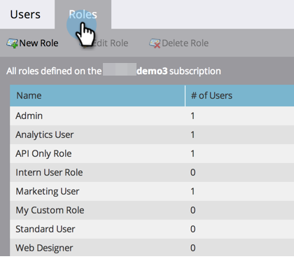

# ユーザのロールと権限の管理 {#managing-user-roles-and-permissions}

ユーザのロールを設定、作成および編集し、ユーザに割り当てます。これにより、各 Marketo ユーザがアクセスできる領域と機能を制御できます。

例えば、通常、マーケティングユーザは、メール、ランディングページ、プログラムを作成、変更、デプロイするために、アプリケーション全体で幅広いアクセス権を持つ必要があります。一方、web デザイナーは、Design Studio でほとんどの時間を過ごし、メールやランディングページで使用するアセットを作成します。また、会社のリーダーは Analytics 領域のMarketoのレポートを幅広く利用しますが、アセットやプログラムを自ら作成または駆動する必要がない場合があります。

>[!NOTE]
>
>**管理者権限が必要**

Marketo には様々なレベルのアクセス権を持つ、次の組み込みのロールが用意されています。

* **管理者** - 「管理者」セクションを含む、アプリケーションのすべての部分
* **標準ユーザ** - 「管理者」セクションを除く、アプリケーションのすべての部分
* **マーケティングユーザ** - 「管理者」セクションを除く、アプリケーションのすべての部分
* **Web デザイナー** - デザインスタジオのみ
* **分析ユーザ** - 「分析」セクションのみ

管理者ロールと標準ユーザロールは編集できませんが、他のロールは編集できます。また、会社の特定の組織構造に合致するカスタムのロールを新たに作成することもできます。

## Marketo と Adobe ID {#marketo-with-adobe-identity}

Marketo を Adobe ID と共に使用している場合、プロファイルの説明のリストは[ここにあります](/help/marketo/product-docs/administration/marketo-with-adobe-identity/adobe-identity-management-overview.md#profile-levels)。

## ユーザへのロールの割り当て {#assign-roles-to-a-user}

[初めてユーザを作成する](/help/marketo/product-docs/administration/users-and-roles/create-delete-edit-and-change-a-user-role.md)とき、または[既存のユーザを編集](/help/marketo/product-docs/administration/users-and-roles/managing-marketo-users.md)するときに、ユーザにロールを割り当てることができます。

1. 「**管理者**」領域に移動します。

   

1. 「**ユーザ＆ロール**」をクリックします。

   

1. リストから、編集するユーザを選択し、「**ユーザを編集**」をクリックします。

   

1. 「**ロール**」で、必要な権限に応じてユーザに割り当てるロールを選択し、「**保存**」をクリックします。

   

   >[!NOTE]
   >
   >各ロールについて詳しくは、[ロール権限の説明](/help/marketo/product-docs/administration/users-and-roles/managing-user-roles-and-permissions/descriptions-of-role-permissions.md)を参照してください。

## ロールの新規作成 {#create-a-new-role}

組織によっては、カスタムの権限の組み合わせが必要な特定のロールを持つ従業員がいる場合があります。

1. 「**管理者**」領域に移動します。

   

1. 「**ユーザ＆ロール**」をクリックします。

   

1. 「**ロール**」タブをクリックします。

   

1. 「**新しいロール**」をクリックします。

   

1. 「**ロール名**」、「**説明**」（オプション）を入力し、このロールのユーザが必要とする権限を選択します。

   

## ロールの編集 {#edit-a-role}

既存のロールに関連付けられている権限を変更する必要がある場合は、ロールを編集できます。

1. 「**管理者**」領域に移動します。

   

1. 「**ユーザ＆ロール**」をクリックします。

   

1. 「**ロール**」タブをクリックします。

   

1. リストから、変更するロールを選択し、「**ロールを編集**」をクリックします。

   

1. 必要に応じて、「**ロール名**」と「**説明**」を変更し、関連する「**権限**」の選択を変更します。

   

   >[!NOTE]
   >
   >編集したロールを持つユーザは、ログアウトしてから再度ログインすると、変更された権限を受け取ります。

## ロールの削除 {#delete-a-role}

ロールが不要になった場合は、ロールを削除できます。

1. 「**管理者**」領域に移動します。

   

1. 「**ユーザ＆ロール**」をクリックします。

   

1. 「**ロール**」タブをクリックします。

   

1. リストから、削除するロールを選択し、「**ロールを削除**」をクリックします。

   

1. 「**削除**」をクリックして確定します。

   
