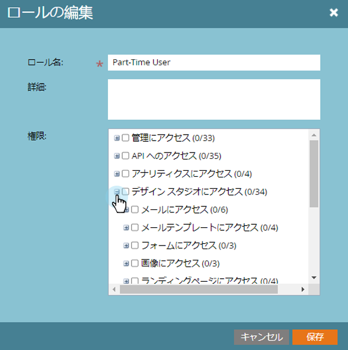

# スニペットのドラフトなしを有効にする{#enable-no-draft-for-snippets}

スニペット用のドラフトなしでは、承認されたアセットを使用してドラフト化することなく、スニペットの変更を配布できます。 編集したスニペットを使用するすべてのアセットに対して、更新が適用され、それぞれのステータスが維持されます。

* 承認されたアセットはスニペットの更新を受け取り、承認を維持します

* ドラフトはスニペットの更新を受け取り、ドラフトモードのままになります。

ドラフトなしは、すべての管理者ロールで自動的に有効になります。 管理者は、任意の追加のロールに対してこの機能を有効にできます。

>[!NOTE]
>
>**必要な管理者権限**

1. **管理者**&#x200B;に移動し、**ユーザーとロール**&#x200B;をクリックします。

   

1. 「**ロール**」タブに移動し、ロールを選択して、「**ロールを編集**」をクリックします。

   

1. 「**Access Design Studio**」オプションを展開します。

   

1. 「**アクセススニペット**」オプションを展開します。

   

1. **スニペットを承認**&#x200B;権限を展開し、**ドラフトなし**&#x200B;ボックスをオンにします。 「**保存**」をクリックします。

   

>[!TIP]
>
>ドラフトなしを無効にするには、上記の手順1 ～ 4に従って、「ドラフトなし」チェックボックスをオフにし、「**保存**」をクリックします。

>[!MORELIKETHIS]
>
>[ドラフトなしのスニペットの承認](../../../../product-docs/personalization/segmentation-and-snippets/snippets/approve-a-snippet-with-no-draft.md)

