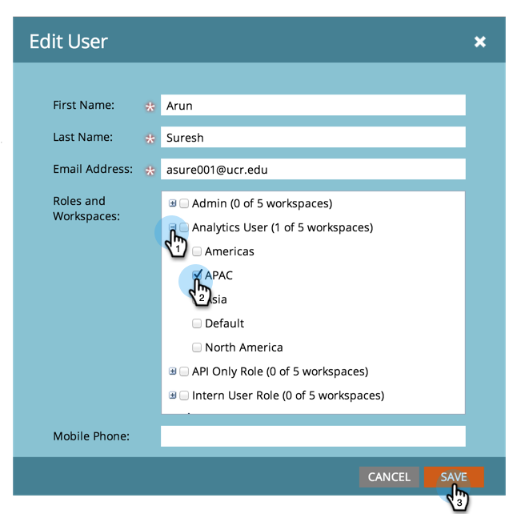
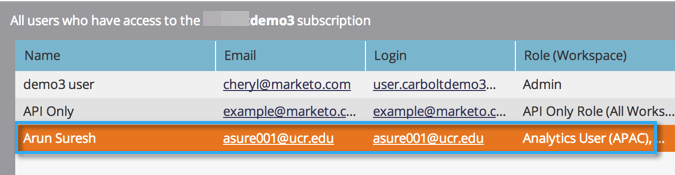

# ワークスペースへのユーザーアクセス権の設定 {#allow-user-access-to-a-workspace}

ワークスペースは、任意の理由（ビジネスユニットや地域の分離など）で使用できます。 アセット（スマートリスト、プログラムなど）を分離し お話します。

>[!NOTE]
>
>**管理者権限が必要**

>[!NOTE]
>
>[ワークスペースの詳細](/help/marketo/product-docs/administration/workspaces-and-person-partitions/understanding-workspaces-and-person-partitions.md)。

1. 「**[!UICONTROL 管理者]**」領域に移動します。

   

1. 「**[!UICONTROL ユーザー＆ロール]**」をクリックします。

   

1. 「**[!UICONTROL ユーザー]**」タブでユーザーを選択し、「**[!UICONTROL ユーザーの編集]**」をクリックします。

   

1. ユーザーにアクセス権を付与する&#x200B;**[!UICONTROL ロールおよびワークスペース]**&#x200B;を選択します。

   

   >[!NOTE]
   >
   >ユーザーに任意の組み合わせでワークスペースにアクセスを許可できます。

変更を保存すると、更新が表示されます。

