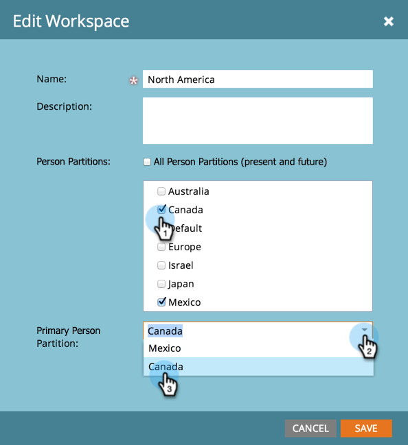
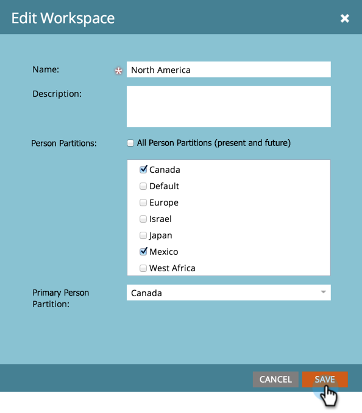

# ワークスペースへの人物パーティションの割り当て {#assign-person-partitions-to-workspaces}

人物パーティション／ワークスペースの割り当てを編集する方法は次のとおりです。

>[!NOTE]
>
>**管理者権限が必要**

>[!PREREQUISITES]
>
>[新しいワークスペースの作成](/help/marketo/product-docs/administration/workspaces-and-person-partitions/create-a-new-workspace.md)

>[!CAUTION]
>
>ワークスペースと人物パーティションは複雑になる場合があります。[Marketo サポート](https://nation.marketo.com/t5/Support/ct-p/Support)にお問い合わせください。セットアップをサポートいたします。

1. 「**管理者**」領域に移動します。

   

1. クリック **ワークスペースとパーティション**.

   

1. ワークスペースを選択し、「**ワークスペースを編集**」をクリックします。

   

1. 変更する人物パーティション情報を編集します。

   

   >[!NOTE]
   >
   >* 「すべての担当者パーティション」チェックボックスは、このワークスペースがシステム内のすべての担当者パーティションにアクセスできることを示します。
   >
   >* プライマリ人物パーティションは、すべての人がエントリされるデフォルトです。人物を移動するには、[フローステップ](/help/marketo/product-docs/core-marketo-concepts/smart-campaigns/flow-actions/use-add-choice-in-a-flow-step.md)または[割り当てルール](/help/marketo/product-docs/administration/workspaces-and-person-partitions/assigning-person-partitions-with-assignment-rules.md)を使用します。

1. 「**保存**」をクリックします。

   

保存後、変更が表示されます。

ワークスペースが正常に編集されました。

>[!MORELIKETHIS]
>
>[ワークスペースと人物パーティションについて](/help/marketo/product-docs/administration/workspaces-and-person-partitions/understanding-workspaces-and-person-partitions.md)。
