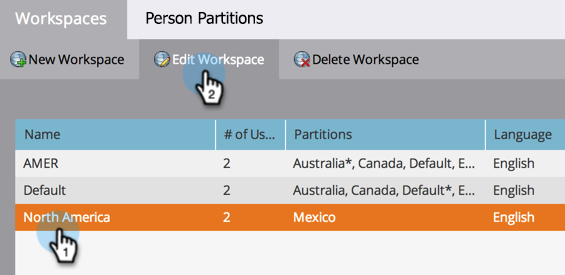
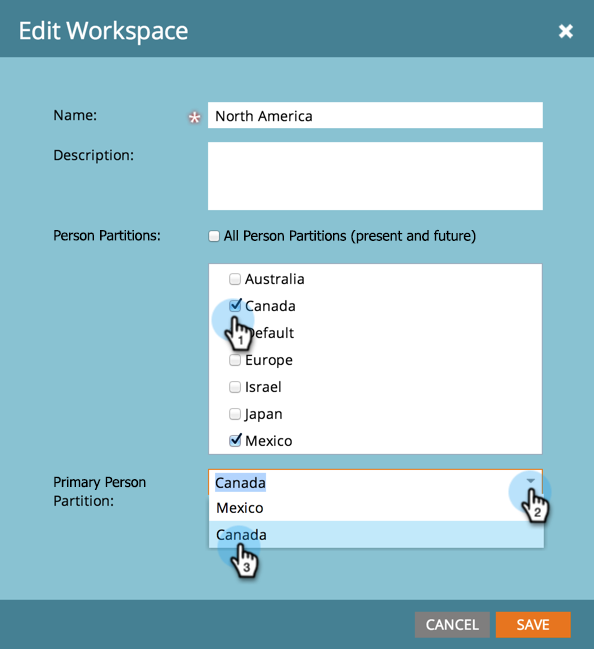
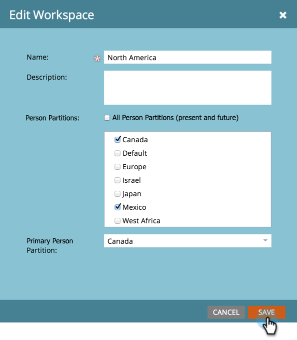
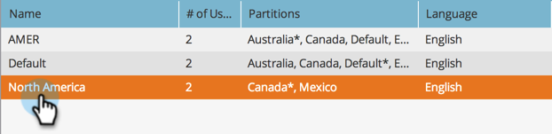

# 顧客パーティションのワークスペースへの割り当て {#assign-person-partitions-to-workspaces}

次の手順に従って、個人パーティションとワークスペースの割り当てを編集します。

>[!NOTE]
>
>**管理者権限が必要**

>[!PREREQUISITES]
>
>[新しいワークスペースの作成](/help/marketo/product-docs/administration/workspaces-and-person-partitions/create-a-new-workspace.md){target="_blank"}

>[!CAUTION]
>
>ワークスペースと顧客パーティションは複雑になる場合があります。 設定のヘルプについては、[Marketo サポート ](https://nation.marketo.com/t5/Support/ct-p/Support){target="_blank"}にお問い合わせください。

1. 「**[!UICONTROL 管理者]**」領域に移動します。

   

1. 「**[!UICONTROL ワークスペースとパーティション]**」をクリックします。

   

1. ワークスペースを選択し、「**[!UICONTROL ワークスペースを編集]**」をクリックします。

   

1. 変更する顧客パーティション情報を編集します。

   

   >[!NOTE]
   >
   >* 「[!UICONTROL すべての人物パーティション]」チェックボックスは、このワークスペースがシステム内のすべての人物パーティションにアクセスできることを示します。
   >
   >* プライマリのユーザーのパーティションは、すべてのユーザーが入力されるデフォルトのパーティションです。 [ フローステップ ](/help/marketo/product-docs/core-marketo-concepts/smart-campaigns/flow-actions/use-add-choice-in-a-flow-step.md)または[割り当てルール ](/help/marketo/product-docs/administration/workspaces-and-person-partitions/assigning-person-partitions-with-assignment-rules.md){target="_blank"}を使用して、パーティション間でユーザーを移動します。

1. 「**[!UICONTROL 保存]**」をクリックします。

   

保存後、変更が表示されます。

>[!MORELIKETHIS]
>
>[ワークスペースと人物パーティションについて](/help/marketo/product-docs/administration/workspaces-and-person-partitions/understanding-workspaces-and-person-partitions.md){target="_blank"}。
