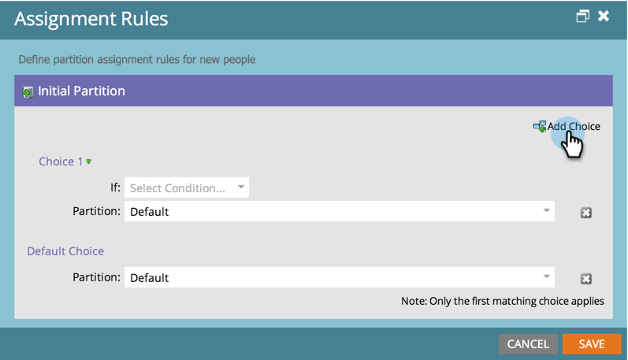
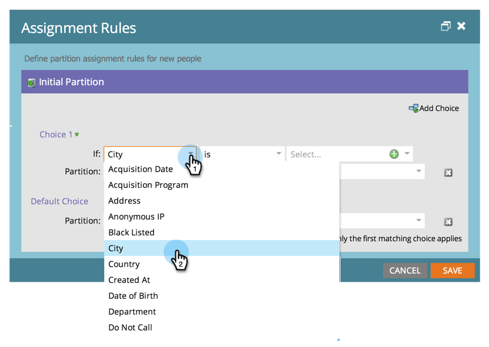
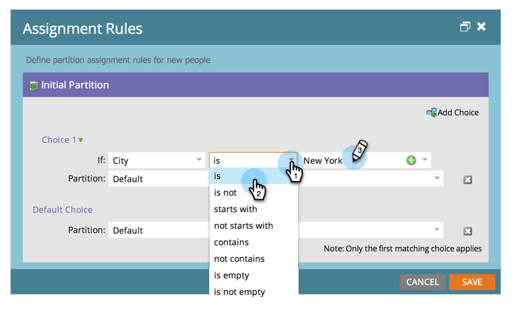
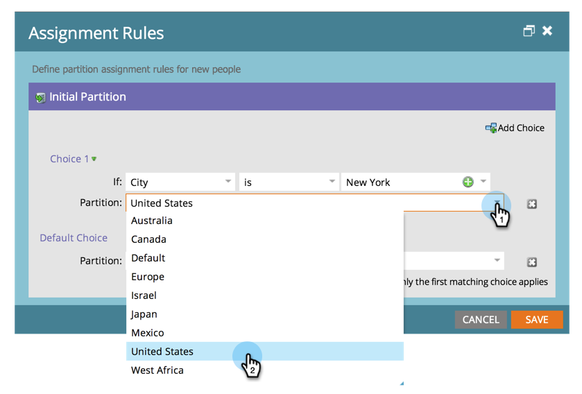

# 割り当てルールを使用した人物パーティションの割り当て {#assigning-person-partitions-with-assignment-rules}

>[!NOTE]
>
>**管理者権限が必要**

>[!PREREQUISITES]
>
>[人物パーティションの作成](/help/marketo/product-docs/administration/workspaces-and-person-partitions/create-a-person-partition.md)

人物パーティションを使用する場合、CRM から作成された人物をそれぞれのパーティションにルーティングする割り当てルールを設定します。

>[!NOTE]
>
>CRM から Marketo で作成され、SOAP API を介して作成された人物のみに割り当てルールが適用されます。

1. 「**[!UICONTROL 管理者]**」領域に移動します。

   

1. 「**[!UICONTROL ワークスペースとパーティション]**」をクリックします。

   

1. 「**[!UICONTROL 人物パーティション]**」タブで、「**[!UICONTROL 割り当てルール]**」をクリックします。

   

1. 「**[!UICONTROL 選択肢を追加]**」をクリックして、人物パーティションに人物をルーティングする条件を追加します。

   

1. 条件を作成するフィールドを選択します。

   

1. 選択肢の演算子を選択して、値を入力します。

   

1. 条件を満たす人物を対象にする人物パーティションを選択します。

   

   >[!NOTE]
   >
   >選択肢は好きなだけ追加できます。

1. 「**[!UICONTROL 保存]**」をクリックします。

   

ユーザーのパーティションの割り当てルールが設定されました。

>[!NOTE]
>
>以前の条件が満たされない場合、デフォルトの選択肢が適用されます。
