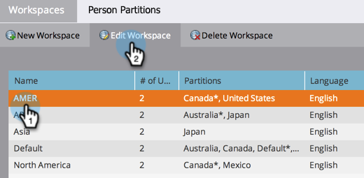
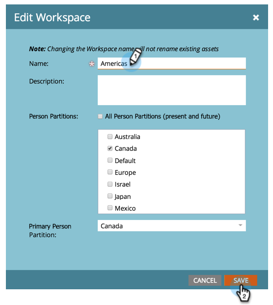
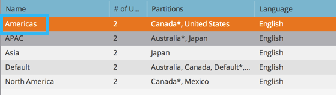

# ワークスペースの名前を変更する {#change-the-name-of-a-workspace}

>[!NOTE]
>
>**管理者権限が必要**

>[!PREREQUISITES]
>
>[新しいワークスペースの作成](/help/marketo/product-docs/administration/workspaces-and-person-partitions/create-a-new-workspace.md)

ワークスペースの名前はユーザーが変更できます。

>[!NOTE]
>
>詳しくは、[&#x200B; ワークスペースとユーザーのパーティションについて](/help/marketo/product-docs/administration/workspaces-and-person-partitions/understanding-workspaces-and-person-partitions.md)を参照してください。

1. 「**[!UICONTROL 管理者]**」領域に移動します。

   

1. 「**[!UICONTROL ワークスペースとパーティション]**」をクリックします。

   

1. ワークスペースを選択し、「**[!UICONTROL ワークスペースを編集]**」をクリックします。

   

1. ワークスペースの新しい&#x200B;**[!UICONTROL 名前]**&#x200B;を入力し、「**[!UICONTROL 保存]**」をクリックします。

   

保存後、変更が反映されていることを確認できます。

