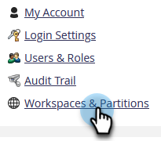

# ワークスペースの名前を変更する {#change-the-name-of-a-workspace}

>[!NOTE]
>
>**管理者権限が必要**

>[!PREREQUISITES]
>
>[新しいワークスペースの作成](/help/marketo/product-docs/administration/workspaces-and-person-partitions/create-a-new-workspace.md)

ワークスペースの名前はユーザが変更できます。手順はとても簡単です。

>[!NOTE]
>
>まず、[ワークスペースと人物パーティションについて](/help/marketo/product-docs/administration/workspaces-and-person-partitions/understanding-workspaces-and-person-partitions.md)を確認してください。

1. 「**[!UICONTROL 管理者]**」領域に移動します。

   

1. 「**[!UICONTROL ワークスペースとパーティション]**」をクリックします。

   

1. ワークスペースを選択し、「**[!UICONTROL ワークスペースの編集]**」をクリックします。

   

1. 新しい **[!UICONTROL 名前]** をクリックし、 **[!UICONTROL 保存]**.

   

保存後、変更が表示されます。

