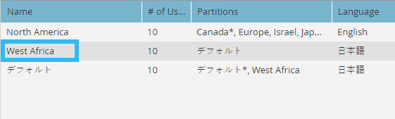

# 新しいワークスペースの作成 {#create-a-new-workspace}

ワークスペースは、会社をさらに細分するのに役立ちます。ワークスペースを設定する理由は次のとおりです。

* 地域：ヨーロッパのマーケティング活動と北米のマーケティング活動の比較
* ビジネスユニット A とビジネスユニット B の比較

新しいワークスペースの作成方法を次に示します。

>[!NOTE]
>
>**管理者権限が必要**

>[!NOTE]
>
>まず、[ワークスペースと人物パーティションについて](/help/marketo/product-docs/administration/workspaces-and-person-partitions/understanding-workspaces-and-person-partitions.md){target="_blank"}を確認してください。

>[!TIP]
>
>Workspace のベストプラクティスの詳細については、 [Marketo Professional Services](https://business.adobe.com/products/marketo/services-support.html){target="_blank"}.

1. 「**管理者**」領域に移動します。

   

1. クリック **ワークスペースとパーティション**.

   

1. クリック **新しいワークスペース**.

   

1. **名前**&#x200B;を入力し、使用する&#x200B;**人物パーティション**&#x200B;を選択します。**プライマリの人物パーティション**&#x200B;を選択します。まだ作成していない場合は、[人物パーティションを作成](/help/marketo/product-docs/administration/workspaces-and-person-partitions/create-a-person-partition.md){target="_blank"}してください。

   

   >[!NOTE]
   >
   >* 「**すべての人物パーティション**」チェックボックスは、このワークスペースがシステムですべてのリードパーティションを使用できることを表します。
   >
   >* **プライマリリードパーティション**&#x200B;がデフォルトとして機能し、すべてのリードが割り当てられます。

   >[!IMPORTANT]
   >
   >複数のブランドドメインを有効にした場合は、プライマリブランドドメインを選択する必要があります。

1. ワークスペースの言語を選択します。

   

   >[!NOTE]
   >
   >作成時に、Marketo はワークスペースにサンプルアセットをシードします。言語を使用すると、シードされたオブジェクトが英語以外の言語で使用できます。

1. 「**作成**」をクリックします。

   

必要な数のワークスペースを作成し、適切な人物パーティションを割り当てます。

ワークスペースを作成した後に、更新が表示されます。

