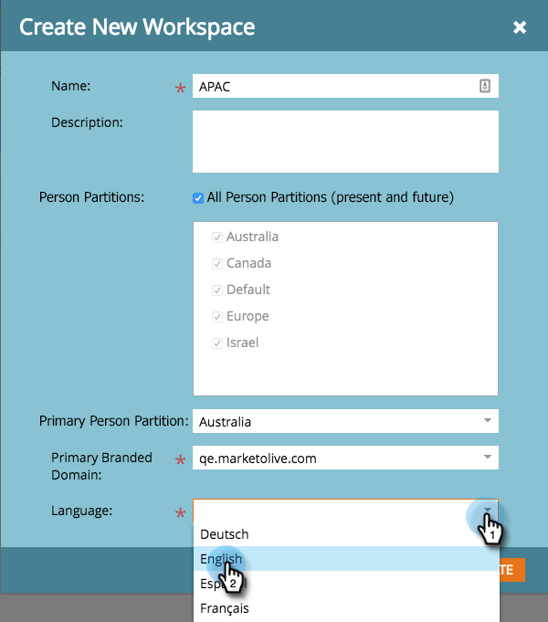
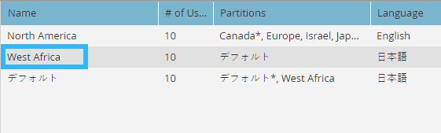

# 新しいワークスペースの作成 {#create-a-new-workspace}

ワークスペースは、会社をさらに細分するのに役立ちます。 ワークスペースを設定する理由は以下のとおりです。

* 地域：ヨーロッパのマーケティング活動と北米のマーケティング活動の比較
* ビジネスユニット A とビジネスユニット B の比較

>[!NOTE]
>
>**管理者権限が必要**

>[!NOTE]
>
>詳しくは、[&#x200B; ワークスペースとユーザーのパーティションについて](/help/marketo/product-docs/administration/workspaces-and-person-partitions/understanding-workspaces-and-person-partitions.md){target="_blank"}を参照してください。

>[!TIP]
>
>Workspaceのベストプラクティスについて詳しくは、[Marketo プロフェッショナルサービス &#x200B;](https://business.adobe.com/products/marketo/services-support.html){target="_blank"}にお問い合わせください。

1. 「**[!UICONTROL 管理者]**」領域に移動します。

   

1. 「**[!UICONTROL ワークスペースとパーティション]**」をクリックします。

   

1. 「**[!UICONTROL 新規ワークスペース]**」をクリックします。

   

1. **[!UICONTROL 名前]**&#x200B;を入力し、使用する&#x200B;**[!UICONTROL 人物パーティション]**&#x200B;を選択します。 **[!UICONTROL プライマリの人物パーティション]**&#x200B;を選択します。 [人のパーティション &#x200B;](/help/marketo/product-docs/administration/workspaces-and-person-partitions/create-a-person-partition.md){target="_blank"}がまだ作成されていない場合は、作成されていることを確認します。

   

   >[!NOTE]
   >
   >* 「**[!UICONTROL すべての人物パーティション]**」チェックボックスは、このワークスペースがシステムですべてのリードパーティションを使用できることを表します。
   >
   >* **[!UICONTROL プライマリ人物パーティション]**&#x200B;がデフォルトとして機能し、すべての人物が割り当てられます。

   >[!IMPORTANT]
   >
   >複数のブランドドメインを有効にした場合は、プライマリブランドドメインを選択する必要があります。

1. ワークスペースの言語を選択します。

   

   >[!NOTE]
   >
   >作成時に、Marketo はワークスペースにサンプルアセットをシードします。 言語を使用すると、シードされたオブジェクトが英語以外の言語で使用できます。

1. 「**[!UICONTROL 作成]**」をクリックします。

   

必要な数のワークスペースを作成し、適切な人物パーティションを割り当てます。

ワークスペースを作成した後に、更新が表示されます。

