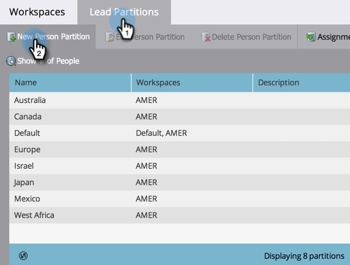
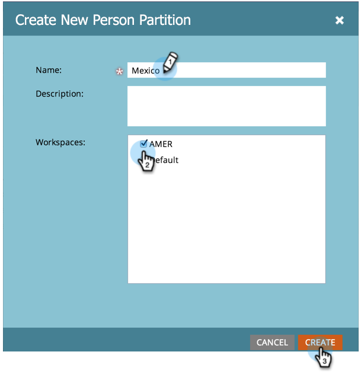

# 人物パーティションの作成 {#create-a-person-partition}

次の手順に従って、新しい人物パーティションを作成します。

>[!NOTE]
>
>**管理者権限が必要**

>[!NOTE]
>
>まず、[ワークスペースと人物パーティションについて](/help/marketo/product-docs/administration/workspaces-and-person-partitions/understanding-workspaces-and-person-partitions.md)を確認してください。

1. 「**[!UICONTROL 管理者]**」領域に移動します。

   

1. 「**[!UICONTROL ワークスペースとパーティション]**」をクリックします。

   

1. 「**[!UICONTROL 人物パーティション]**」タブに移動し、「**[!UICONTROL 新規人物パーティション]**」をクリックします。

   

1. パーティションに名前を付け、 **[!UICONTROL Workspaces]** 表示される場所で、 **[!UICONTROL 作成]**.

   

パーティションを作成後、更新が表示されます。

