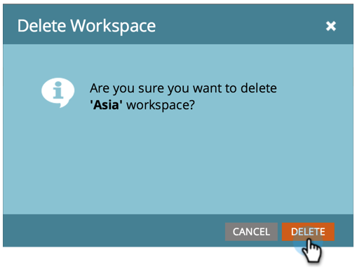

# ワークスペースの削除{#delete-a-workspace}

>[!NOTE]
>
>**必要な管理者権限**

>[!NOTE]
>
>Marketorのデフォルトのワークスペースを削除できません。

1. 「管理者」で、「ワークスペースとパーティション」をクリックします。

   

1. ワークスペースを選択し、「ワークスペースを削除」をクリックします。

   

   >[!NOTE]
   >
   >**Reminder**
   >
   >重要：ワークスペース内のすべてのアセットを最初に削除する必要があります。

1. 「削除」をクリックして確定します。

   

