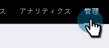
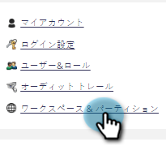
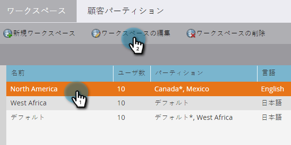
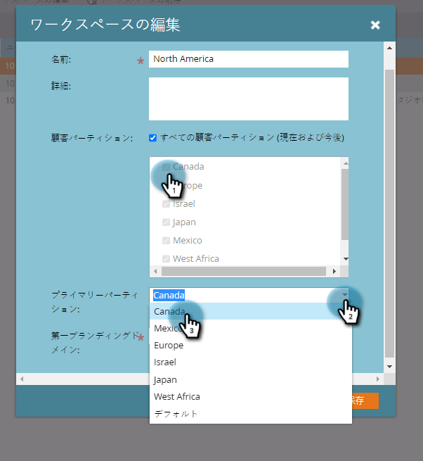
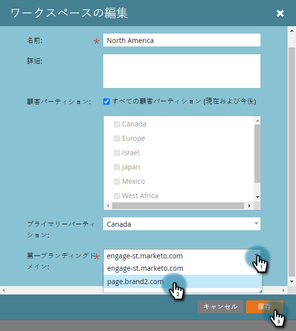

# ワークスペースを編集する {#edit-a-workspace}

ときには、ワークスペースで変更が必要になる場合があります。方法は簡単です。

>[!NOTE]
>
>**管理者権限が必要**

>[!NOTE]
>
>[ワークスペースと人物パーティションについて](/help/marketo/product-docs/administration/workspaces-and-person-partitions/understanding-workspaces-and-person-partitions.md)を参照して、ワークスペースの知識を磨いてください。

1. 「**管理者**」領域に移動します。

   

1. クリック **ワークスペースとパーティション**.

   

1. 編集するワークスペースを選択し、「**ワークスペースの編集**」をクリックします。

   

1. 別のリードパーティションを選択し、ドロップダウンから別のプライマリリードパーティションを選択できます。

   >[!NOTE]
   >
   >必要に応じて、さらに[リードパーティションを作成](/help/marketo/product-docs/administration/workspaces-and-person-partitions/create-a-person-partition.md)できます。

   

   >[!NOTE]
   >
   >「**すべてのリードパーティション（現在および今後）**」チェックボックスは、このワークスペースがシステムですべてのリードパーティションを使用できることを表します。

   >[!NOTE]
   >
   >**プライマリリードパーティション**&#x200B;がデフォルトとして機能し、すべてのリードが割り当てられます。

   複数のブランドドメインを有効にした場合、別のプライマリブランドドメインに切り替えることができます。「**保存**」をクリックします。

   

   >[!NOTE]
   >
   >ワークスペースの言語は変更できません。

>[!MORELIKETHIS]
>
>* [新しいワークスペースの作成](/help/marketo/product-docs/administration/workspaces-and-person-partitions/create-a-new-workspace.md)
>* [ワークスペースと人物パーティションについて](/help/marketo/product-docs/administration/workspaces-and-person-partitions/understanding-workspaces-and-person-partitions.md)

