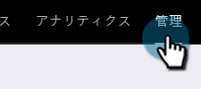
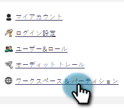
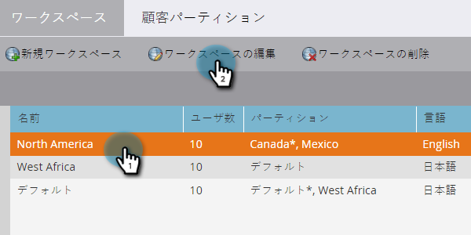
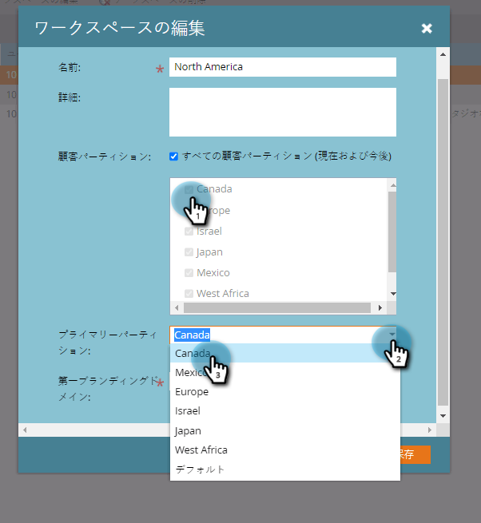
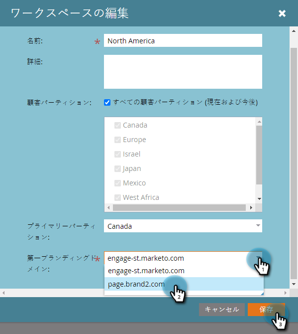

# ワークスペースを編集する {#edit-a-workspace}

ときには、ワークスペースで変更が必要になる場合があります。

>[!NOTE]
>
>**管理者権限が必要**

>[!NOTE]
>
>ワークスペースについて詳しくは、[&#x200B; ワークスペースとユーザーのパーティションについて](/help/marketo/product-docs/administration/workspaces-and-person-partitions/understanding-workspaces-and-person-partitions.md){target="_blank"}を参照してください。

1. 「**[!UICONTROL 管理者]**」領域に移動します。

   

1. 「**[!UICONTROL ワークスペースとパーティション]**」をクリックします。

   

1. 編集するワークスペースを選択し、「**[!UICONTROL ワークスペースの編集]**」をクリックします。

   

1. 別のリードパーティションを選択し、ドロップダウンから別のプライマリ人物パーティションを選択できます。

   >[!NOTE]
   >
   >必要に応じて、さらに[リードパーティションを作成](/help/marketo/product-docs/administration/workspaces-and-person-partitions/create-a-person-partition.md){target="_blank"}できます。

   

   >[!NOTE]
   >
   >「**[!UICONTROL すべてのリードパーティション（現在および今後）]**」チェックボックスは、このワークスペースがシステムですべてのリードパーティションを使用できることを表します。

   >[!NOTE]
   >
   >**[!UICONTROL プライマリ人物パーティション]**&#x200B;がデフォルトとして機能し、すべての人物が割り当てられます。

   複数のブランドドメインを有効にした場合、別のプライマリブランドドメインに切り替えることができます。 「**[!UICONTROL 保存]**」をクリックします。

   

   >[!NOTE]
   >
   >ワークスペースの言語は変更できません。

>[!MORELIKETHIS]
>
>* [新しいワークスペースの作成](/help/marketo/product-docs/administration/workspaces-and-person-partitions/create-a-new-workspace.md){target="_blank"}
>* [ワークスペースと人物パーティションについて](/help/marketo/product-docs/administration/workspaces-and-person-partitions/understanding-workspaces-and-person-partitions.md){target="_blank"}
