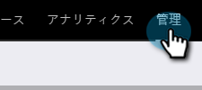
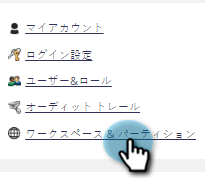
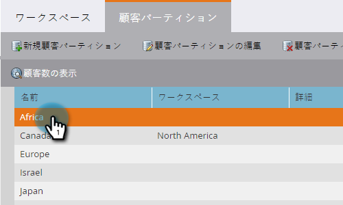
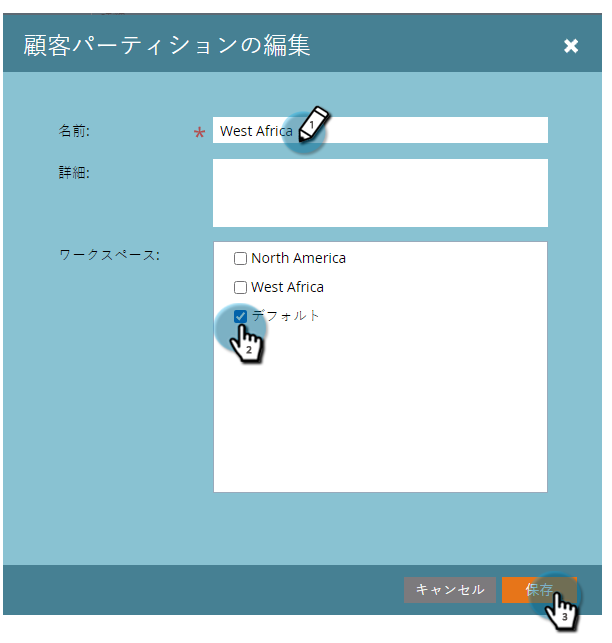
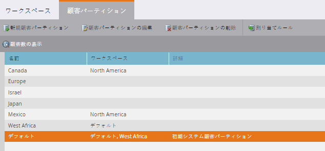

# 既存の人物パーティションを編集する {#edit-an-existing-person-partition}

人物パーティションは、2 つ目（あるいは 3 つ目）のデータベースを持つようなものです。パーティションは 1 つまたは複数のワークスペースに割り当てることができます。パーティションの詳細は以下の手順で編集します。

>[!NOTE]
>
>**管理者権限が必要**

>[!PREREQUISITES]
>
>[人物パーティションの作成](/help/marketo/product-docs/administration/workspaces-and-person-partitions/create-a-person-partition.md)

1. 「**管理者**」領域に移動します。

   

1. 「**ワークスペースとパーティション**」をクリックします。

   

1. 「**人物パーティション**」タブで、編集したい人物パーティションを選択し、「**人物パーティションの編集**」をクリックします。

   

1. 「**名前**」に人物パーティションの名前を入力し、**ワークスペース**&#x200B;で割り当て先のワークスペースを選択して、「**保存**」をクリックします。

   

1. 変更を保存すると、更新が表示されます。

   
