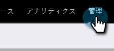
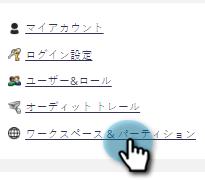
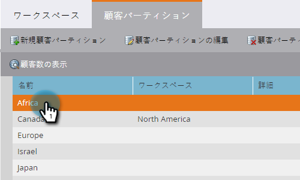
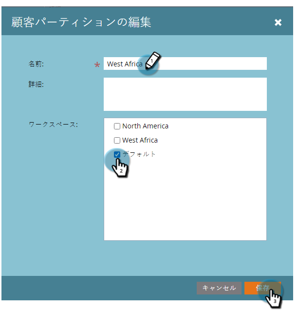
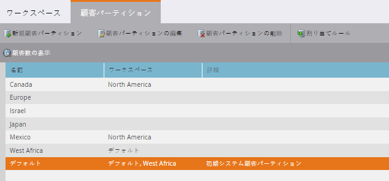

# 既存の人物パーティションを編集する {#edit-an-existing-person-partition}

人物パーティションは、2 つ目（あるいは 3 つ目）のデータベースを持つようなものです。 パーティションは 1 つまたは複数のワークスペースに割り当てることができます。

>[!NOTE]
>
>**管理者権限が必要**

>[!PREREQUISITES]
>
>[人物パーティションの作成](/help/marketo/product-docs/administration/workspaces-and-person-partitions/create-a-person-partition.md){target="_blank"}

1. 「**[!UICONTROL 管理者]**」領域に移動します。

   

1. 「**[!UICONTROL ワークスペースとパーティション]**」をクリックします。

   

1. 「**[!UICONTROL 人物パーティション]**」タブで、編集したい人物パーティションを選択し、「**[!UICONTROL 人物パーティションの編集]**」をクリックします。

   

1. 「**[!UICONTROL 名前]**」に人物パーティションの名前を入力し、**[!UICONTROL ワークスペース]**&#x200B;で割り当て先のワークスペースを選択して、「**[!UICONTROL 保存]**」をクリックします。

   

変更を保存すると、更新が表示されます。

