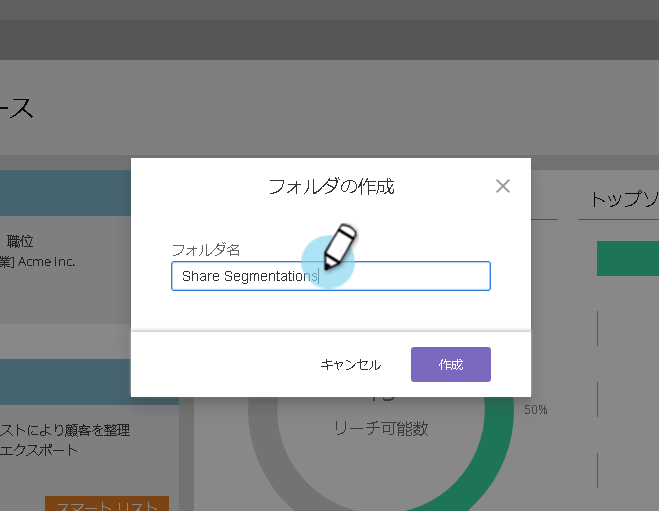

# ワークスペースとパーティション間でセグメントを共有 {#share-segmentations-across-workspaces-and-partitions}

>[!NOTE]
>
>**前提条件**
>
>この記事は、ワークスペースとパーティションを持つお客様向けです

## 分類とは {#whats-a-segmentation}

プログラムやスマートなキャンペーンに適した人材を選ぶのがMarketorの得意です。 ただし、より永久的なパーソナルの場合は、セグメント化を使用する必要があります。 Marketorでは、高度な動的コンテンツを使用する必要があります。

>[!NOTE]
>
>**ディープダイブ**
>
>セグメント [を作成する方法を説明します](../../../product-docs/personalization/segmentation-and-snippets/segmentation/create-a-segmentation.md)。

これらのユーザーを設定したら(**およびワークスペースを使用する** )、それらをワークスペース間で共有できます。 次に、良い知識を示します。

## ルールとヒント {#rules-tips}

* 各Marketor購読には、複数のワークスペース全体で最大20個のセグメントを「合計」で含めることができます(ワークスペースあたり20個&#x200B;**ではありません**)。
* セグメントは、アクセス権を持つワークスペースとのみ共有できます。
* すべてのパーティションを表示する **デフォルトのワークスペースを作成して使用してください**。

* セグメント化処理は、ワークスペース内でセグメントが作成されたユーザーに対してのみ実行されます。

   * デフォルトのワークスペース内で共有するセグメントを作成します。

      * セグメントの承認
      * 共有ワークスペースにはロックされたフォルダーが表示され、セグメントは読み取り専用です。
      * 共有バージョンは編集できません。 元のセグメントは、作成元でのみ編集できます。
   * 共有セグメント内のセグメント（医療など）をクリックすると、表示される訪問者は、表示中のワークスペースに関連付けられたパーティション内の訪問者のみになります。

      * Workspace 1(WS1)でセグメントを作成し、WS2と共有する場合、WS1はWS2のパーティションにアクセスできず、セグメントは再計算されません。
      * パーティションが制限されたワークスペースでセグメントを作成し、他のワークスペースで共有する場合、共有セグメントを受け取ったワークスペースでは、訪問者が重複している場合にのみ表示されます。

>[!NOTE]
>
>これらのルールの中には、少し複雑なものもあります。 最も簡単に作業を開始するには、特定のユーザーを使用してテストを行います。 新しいセグメントを作成し、古いセグメントを削除することができます。

## シナリオの例 {#example-scenarios}

** 

**

## セグメントの共有 {#share-a-segmentation}

1. データベースに移動します。

   

1. 「Segmentations」を右クリックし、「New Folders」を選択します。

   

1. 複数のワークスペースで共有するフォルダーの名前を指定します(例：共有セグメントを参照)。

   

1. 共有するセグメントをフォルダーに移動します。

   

1. フォルダーを右クリックし、「Share Folder」を選択します。

   

1. フォルダーを共有するワークスペースを選択します。 「保存」をクリックします。

   

   >[!NOTE]
   >
   >このダイアログには、表示に対する権限を持つワークスペースが表示されます。そのため、すべてのワークスペースとパーティションを表示できるデフォルトワークスペースからセグメントを作成して共有することをお勧めします。

元のフォルダーがデータベースツリーに表示され、他のワークスペースと共有されていることを示す矢印が表示されます。 共有ワークスペース内では、フォルダーがロック付きで表示され、そのフォルダーのコンテンツが別のワークスペースから共有され、読み取り専用であることを示します。

>[!NOTE]
>
>**関連記事**
>
>[セグメントとスニペット](http://docs.marketo.com/display/docs/segmentation+and+snippets)

