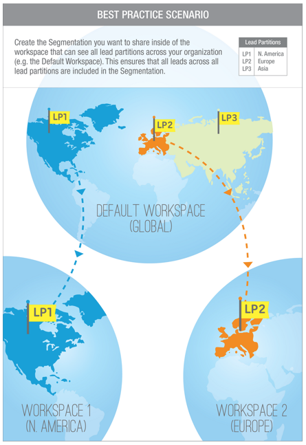
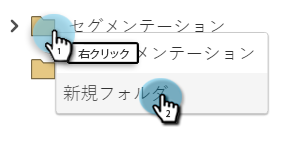
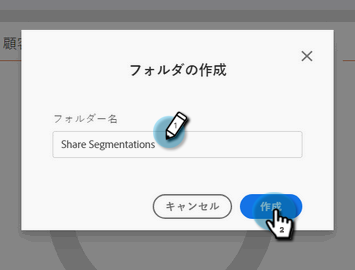
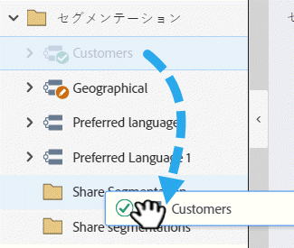
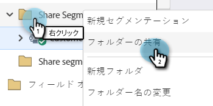
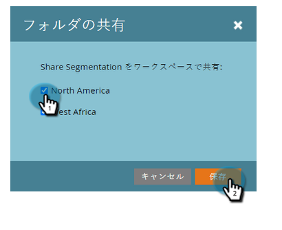

# ワークスペースとパーティションをまたいだセグメント化の共有 {#share-segmentations-across-workspaces-and-partitions}

>[!PREREQUISITES]
>
>この記事は、ワークスペースとパーティションをお使いのお客様専用です。

## セグメンテーションとは？ {#whats-a-segmentation}

Marketoは、プログラムやスマートキャンペーンに適した人物を特定します。 ただし、より永続的なペルソナの場合は、セグメント化を使用する必要があります。 セグメント化は、Marketo で高度な動的コンテンツを使用するために必要です。

>[!NOTE]
>
>[セグメント化の作成方法](/help/marketo/product-docs/personalization/segmentation-and-snippets/segmentation/create-a-segmentation.md)を参照してください。

これらのペルソナを設定したら（_および_&#x200B;ワークスペースを使用している場合）、ワークスペース全体で共有します。 次に、知っておくといい点を示します。

## ルールとヒント {#rules-tips}

* 各 Marketo サブスクリプションには、複数のワークスペースをまたいで最大 20 個のセグメントを「合計」で含めることができます（**1 ワークスペースあたり 20 ではありません**）。
* セグメント化は、アクセス権のあるワークスペースとのみ共有できます。
* すべてのパーティションを可視化する&#x200B;**デフォルトのワークスペース**&#x200B;を作成して活用します。

* セグメント化処理は、セグメント化が作成されたワークスペース内の人物に対してのみ実行されます。

   * デフォルトのワークスペース内で共有するセグメントを作成します。
      * セグメント化の承認
      * 共有ワークスペースにはロックされたフォルダーが表示され、セグメント化は読み取り専用です。
      * 共有バージョンは編集できません。 元のセグメントを作成した場所でのみ編集できます。

   * 共有セグメント内のセグメント（医療など）をクリックすると、表示される人物は、表示中のワークスペースに関連付けられたパーティション内の人物のみになります。
      * Workspace 1 （WS1）でセグメント化を作成し、それをWS2と共有し、WS1がWS2のパーティションにアクセスできない場合、セグメント化は再計算されません。
      * パーティションが制限されたワークスペースでセグメント化を作成し、別のワークスペースで共有した場合、共有セグメントを受け取ったワークスペースには、重複したユーザのみが表示されます。

>[!NOTE]
>
>これらのルールのいくつかは複雑です。 特定の人を対象とした検査が推奨されます。 必要に応じて、新しいセグメントを作成したり、古いセグメントを削除したりできます。

## シナリオの例 {#example-scenarios}

## セグメントの共有 {#share-a-segmentation}

1. **[!UICONTROL データベース]**&#x200B;に移動します。

   

1. 「**[!UICONTROL セグメント化]**」を右クリックし、「**[!UICONTROL 新規フォルダー]**」を選択します。

   

1. ワークスペース間で共有するフォルダーに名前を付け（例：セグメントを共有）、**[!UICONTROL 作成]**&#x200B;をクリックします。

   

1. 共有するセグメントをフォルダーに移動します。

   

1. フォルダーを右クリックし、「**[!UICONTROL フォルダーを共有]**」を選択します。

   

1. フォルダーを共有するワークスペースを選択します。 「**[!UICONTROL 保存]**」をクリックします。

   

   >[!NOTE]
   >
   >このダイアログには、表示権限を持つワークスペースが表示されます。そのため、Marketo では、すべてのワークスペースとパーティションを表示できるデフォルトワークスペースからセグメント化を作成して共有することをお勧めします。

元のフォルダーは、他のワークスペースと共有されていることを示す矢印付きのデータベースツリーに表示されます。 共有ワークスペース内では、フォルダーはロック付きで表示され、そのフォルダーの内容が別のワークスペースから共有され、読み取り専用であることを示します。
