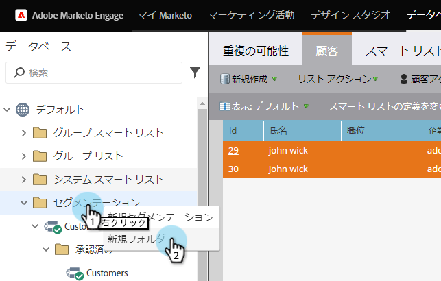

# ワークスペースと個人パーティションの理解 {#understanding-workspaces-and-person-partitions}

## Workspaces {#workspaces}

>[!CAUTION]
>
>ワークスペースは複雑に設定できます。  お客様にとって適切かどうかは、 [マーケティング担当者にお問い合わせください](http://support.marketo.com/) 。

ワークスペースは、プログラム、ランディングページ、電子メールなどのマーケティングアセットを保持する、Marketorの別の領域です。 複数の人が使用できます。 各ユーザーは1つ以上のワークスペースにアクセスできます。

>[!NOTE]
>
>**例**
>
>ワークスペースを使用する理由はいくつかあります。
>
>* 地域：ヨーロッパ、アジア、北米のマーケティング部門にはそれぞれワークスペースがあります。
>* 部署：Quicken、Quickbooks、TurboTaxはそれぞれワークスペースを提供

>
>
どちらの場合も、マーケティングアセットが完全に異なるので、この分離は行われます。 ユーザーがマーケティングアセットを共有している場合、ワークスペースが適切なツールでない可能性があります。

>[!NOTE]
>
>**ディープダイブ**
>
>新しいワークスペースを作成する方法を説明し [ます](create-a-new-workspace.md)。

## ワークスペース間での共有 {#sharing-across-workspaces}

ワークスペース間でアセットを共有する方法を次に示します。 共有したいものに対しても同じように機能します。この例では、セグメント化を示します。

>[!NOTE]
>
>アセットを含む親フォルダーは、共有できる唯一のフォルダーで、子フォルダーではありません。

1. 新しいフォルダーを作成します。

   

1. 共有するフォルダーの名前を指定します。

   

1. 共有するアセットをフォルダーに移動します。

   

1. フォルダーを右クリックし、「 **Share Folder**」を選択します。

   

1. フォルダーを共有するワークスペースを選択し、「 **保存**」をクリックします。 フォルダーを共有ダイアログボックスには、表示する権限を持つワークスペースのみが表示されます。

   

   >[!NOTE]
   >
   >元のフォルダーに小さな緑の矢印が表示され、共有されたことが示されます。 共有されたワークスペースには、読み取り専用を示すパドロックが表示されます。

これらの項目は、複数のワークスペースで共有できます。

* 電子メールテンプレート
* ランディングページテンプレート
* モデル
* スマートキャンペーン
* [スマートリスト](../../../product-docs/core-marketo-concepts/smart-lists-and-static-lists/using-smart-lists/reference-a-list-or-smart-list-across-workspaces.md)
* [セグメント](share-segmentations-across-workspaces-and-partitions.md)
* スニペット

## ワークスペース間でのコピー {#cloning-across-workspaces}

テンプレートではないアセットの場合は、プログラム内でローカルアセットとしてコピーするのが最適です。  適切なアクセスレベルで、次のアセットを別のワークスペースにドラッグ&amp;ドロップできます。

* プログラム
* 電子メール
* ランディングページ
* Forms

>[!NOTE]
>
>テンプレートを含むアセットをコピーする場合、それらのテンプレートはコピー先のワークスペースで共有する必要があります。

## 他のワークスペースへのアセットの移動 {#moving-assets-to-other-workspaces}

アセットを新しいワークスペースに移動するには、アセットをフォルダーに移動し、そのフォルダーを別のワークスペースにドラッグします。

>[!NOTE]
>
>メンバーを含むプログラムをワークスペース間で移動することはできません。

## 個人パーティション {#person-partitions}

個人パーティションは、個別のデータベースのように機能します。 各パーティションには、重複を排除しない、または他のパーティションと混在しない独自のユーザーが存在します。 同じ電子メールアドレスを持つ重複レコードが必要になる場合があるビジネス用途がある場合は、 [マーケティング担当者にお問い合わせください](http://support.marketo.com)。

次の設定で、個人パーティションを [Workspaces](create-a-new-workspace.md) に割り当てることができます。

* 1つのワークスペースから1つのユーザーパーティション(1:1)
* 1つのワークスペースから複数のパーティションへの接続(1:x)
* 多数のワークスペースから1人のパーティション(x:1)

>[!NOTE]
>
>**例**
>
>人物パーティションを使用する理由：
>
>* ワークスペースは、異なるアセットを持つだけでなく、他のユーザーとも共有しません
>* 他のビジネス上の理由で重複が必要

>

>[!CAUTION]
>
>個人パーティションは相互にやり取りしないので、設定する際は注意が必要です。

>[!NOTE]
>
>**ディープダイブ**
>
> 個人パーティションを [作成する方法を説明します](create-a-person-partition.md)。

