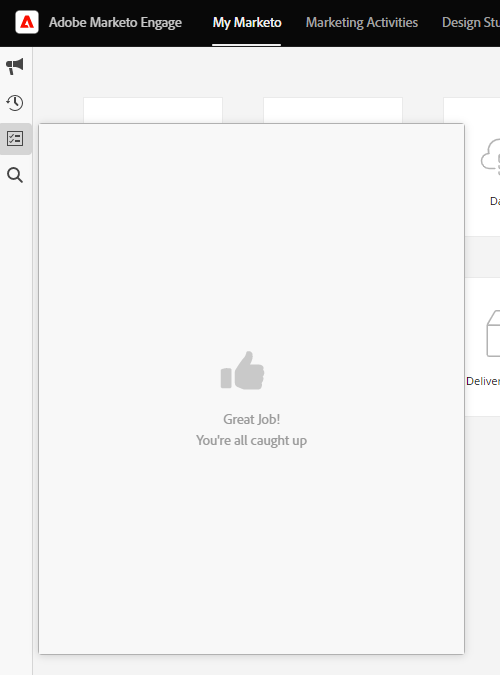

# Adobe Experience Cloud Interface の概要 {#adobe-experience-cloud-interface-overview}

Adobe Experience Cloudインターフェイスは、Adobe Experience Cloudアプリケーションおよびサービスの「シェル」ルックアンドフィールを揃えます。 ただの新しいデザインではありません。単一のインスタンスでユーザエクスペリエンスを提供する単一ページアプリケーションです。

## ユーザフロー {#user-flow}

Adobe Experience Cloud 製品にまだログインしていない場合は、[!DNL Marketo Engage]こちら：[https://experience.adobe.com/marketo-engage](https://experience.adobe.com/marketo-engage).に直接ログインします。

既に Adobe Experience Cloud 製品にログイン&#x200B;_している_&#x200B;場合は、メニューアイコンをクリックし、**[!DNL Marketo Engage]**.を選択します。

>[!NOTE]
>
>ドロップダウンメニューは、購読している Adobe Experience Cloud 製品に応じて異なる表示になる場合があります。

## 新機能 {#new-features}

最新のルックアンドフィールに加えて、次の機能が見られます。

**統合ヘルプセンター**

[!DNL Marketo Engage] アプリケーションから使用可能な様々なヘルプリソースにアクセスできます。

**アプリケーションの切り替え**

複数のアドビ製品にアクセスできるユーザは、簡単に切り替えることができます。

**通知とお知らせ**

製品固有の通知や一般的なアドビ製品のお知らせを、アプリケーションで直接表示および操作します。

**アドビ設定**

プロファイルアイコンをクリックして、言語やその他のアドビ全体の環境設定を変更します。

## よくある質問 {#faq}

**にログインできません [!DNL Marketo Engage] を使用します。 問題の原因**

Adobe Experience Cloud にログインできるが、「ページの読み込みに失敗しました」というエラーが表示される場合は、[!DNL Marketo Engage] 側の問題が考えられます。サポートが必要な場合は [Marketo サポート](https://nation.marketo.com/t5/support/ct-p/Support)にお問い合わせください。

**ユーザ履歴、グローバル検索、Marketo 通知およびタスクトレイはどこに移動しましたか？**

これらの機能は、上部のナビゲーションから、Experience Cloudインターフェイスの左側にある新しいバーに移動しました。

